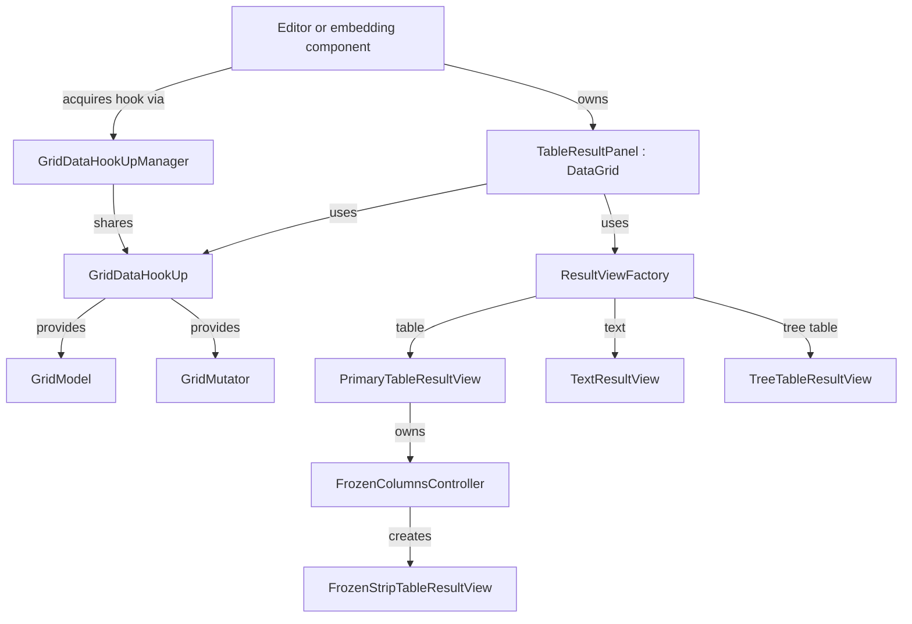

# Grid implementation

`intellij.grid.impl` provides the shared Swing grid, result views, editor integration, and grid actions.
This module owns the Swing views and panel.
The [core-impl module](../core-impl) provides the models, hook interfaces, and indices.
The [grid overview](../README.md) explains the module names.

## Main relationships



| Interface or class                                               | Role                                                                                                |
|------------------------------------------------------------------|-----------------------------------------------------------------------------------------------------|
| [DataGrid](src/datagrid/DataGrid.java)                           | Extends `CoreGrid` with UI operations, presentation settings, and grid events.                      |
| [TableResultPanel](src/run/ui/TableResultPanel.java)             | Implements `DataGrid`. Coordinates the hook, active view, column state, and editing.                |
| [GridDataHookUp](../core-impl/src/datagrid/GridDataHookUp.java)  | Supplies models, loading, paging, sorting, filtering, and an optional mutator.                      |
| [GridDataHookUpManager](src/datagrid/GridDataHookUpManager.java) | Registers hooks and shares them through handles tied to a parent disposable.                        |
| [GridModel](../core-impl/src/datagrid/GridModel.java)            | Exposes rows, columns, values, and model events.                                                    |
| [GridMutator](../core-impl/src/datagrid/GridMutator.java)        | Changes data. Additional interfaces support row, column, and database operations.                   |
| [ResultView](src/datagrid/ResultView.java)                       | Connects a presentation to the grid through model events, selection, editing, and index conversion. |
| [ResultViewFactory](src/run/ui/ResultViewFactory.java)           | Creates and wraps the view for the selected `GridPresentationMode`.                                 |
| [GridTableModel](src/run/ui/table/GridTableModel.java)           | Adapts grid data and events to Swing. Regular and transposed models define the axes.                |

[DataGridListener](src/datagrid/DataGridListener.java) reports content, selection, and presentation changes to other UI components.

## Data access and coordinates

The hook provides two models.
[DataAccessType](../core-impl/src/run/ui/DataAccessType.java) chooses which model the grid reads:

| Access type           | Model                                                                           |
|-----------------------|---------------------------------------------------------------------------------|
| `DATABASE_DATA`       | Source data without pending edits.                                              |
| `DATA_WITH_MUTATIONS` | Source data with pending edits, including inserted or deleted rows and columns. |

These access types apply to both database grids and file grids.
`TableResultPanel` listens to the `DATA_WITH_MUTATIONS` model and forwards model events to the active view.

[ModelIndex](../core-impl/src/datagrid/ModelIndex.java) identifies a position in the data model.
[ViewIndex](../core-impl/src/datagrid/ViewIndex.java) identifies a position in the view.
[RawIndexConverter](../core-impl/src/datagrid/RawIndexConverter.java) maps between them.
Sorting, filtering, visibility, and column moves change view positions.
A `ModelIndex` is a numeric position.
After the source replaces or renumbers columns, an old index can be invalid or point to another column; `isValid` does not detect the latter.
Resolve the column again by its unique name with `GridUtil.findColumn(grid, name)`.

[SelectionModel](../core-impl/src/datagrid/SelectionModel.java) exposes selection in model coordinates.
[TableSelectionModel](src/run/ui/table/TableSelectionModel.java) maps it to Swing selection.

## View and column ownership

[TableResultView](src/run/ui/table/TableResultView.java) provides the common table behavior.
[PrimaryTableResultView](src/run/ui/table/PrimaryTableResultView.kt) adds grid integration and owns the frozen region.
[FrozenStripTableResultView](src/run/ui/table/FrozenStripTableResultView.kt) renders the pinned columns.
[FrozenColumnsController](src/run/ui/table/FrozenColumnsController.kt) coordinates both tables (selection, dimensions, model updates)
and forwards frozen header moves to the primary view.
[TextResultView](src/run/ui/text/TextResultView.java) formats rows into an editor document.
[TreeTableResultView](src/run/ui/treetable/TreeTableResultView.java) presents rows as trees of fields.

[TableResultPanel](src/run/ui/TableResultPanel.java) stores the column order.
The table and popup derive their displayed order from it.

[GridColumnPinModel](src/run/ui/table/GridColumnPinModel.kt) stores the pin state.
[GridColumnPinning](src/run/ui/GridColumnPinning.kt) exposes pin operations.
[ResultViewWithFrozenColumns](src/run/ui/ResultViewWithFrozenColumns.kt) lets a compatible view render the pinned region.
[DisplayedColumnOrder](src/run/ui/table/DisplayedColumnOrder.kt) maps navigation to the presentation with pinned columns first.

[ColumnsListPopup](src/run/ui/columns/ColumnsListPopup.kt) handles the UI and delegates column commands, popup state, and metadata loading to
[ColumnsListController](src/run/ui/columns/ColumnsListController.kt).

[HierarchicalTableResultPanel](src/run/ui/HierarchicalTableResultPanel.kt) adds nested table navigation and column collapse.
[HierarchicalColumnsCollapseManager](src/datagrid/HierarchicalColumnsCollapseManager.java) tracks collapsed column subtrees.

## Invariants

- The stored column order includes hidden columns.
- Pin state is separate from column order; pin grouping changes only the presentation.
- The frozen strip uses its own index converter because it contains a subset of columns.
- Transpose swaps the table axes: table columns then represent data rows.

## Embedding and editing

Create a grid with [GridUtil.createDataGrid](src/datagrid/GridUtil.java).
Supply the project, hook, popup actions, and a configuration callback.
The callback installs `GridHelper` with `GridHelper.set` and the cell factories.
The panel selects `ResultViewFactory` from the presentation mode.

[GridHelper](src/datagrid/GridHelper.kt) supplies source-specific behavior, column presentation, formatting, and export support.
[GridCellRendererFactory](src/run/ui/grid/renderers/GridCellRendererFactory.java) supplies cell renderers.
[GridCellEditorFactoryProvider](src/run/ui/grid/editors/GridCellEditorFactoryProvider.java) selects cell editors.

The cell editor sends its value through `DataGrid.setValueAt` to the hook's mutator.
For deferred updates, the `DATA_WITH_MUTATIONS` model exposes the pending value.
`GridMutator.DatabaseMutator.submit` applies pending changes; `revert` discards them.
Some hooks, including document hooks, apply edits immediately.

[TableFileEditor](src/editor/TableFileEditor.java) connects a grid to the file editor lifetime and starts loading through
[GridLoader](../core-impl/src/datagrid/GridLoader.java) when the editor appears.

## Threading and lifetime

[GridMutationModel](../core-impl/src/run/ui/grid/GridMutationModel.java) delivers model events synchronously on the caller's thread,
so hooks must change their models on the EDT.
[DocumentDataHookUp](../core-impl/src/datagrid/DocumentDataHookUp.java) parses data in the background, then updates the models on the EDT.
[GridDataHookUpBase](../core-impl/src/datagrid/GridDataHookUpBase.java) reports progress, completion, and errors through
[GridDataHookUp.RequestListener](../core-impl/src/datagrid/GridDataHookUp.java) on the EDT.

Register the grid under the host's disposable.
Grid disposal removes its subscriptions, disposes its view, and cancels its tasks.
The hook has a separate lifetime; the host keeps its hook reference alive until the grid has disposed.

`GridDataHookUpManager` registers new hooks and shares existing ones through `getHandle` and `acquire(handle, parent)`,
which ties the reference to the parent's lifetime.
A disposable hook is disposed when its reference count reaches zero;
`FileEditorManagerImpl.CLOSING_TO_REOPEN` preserves the count while an editor reopens.

## Tests

Grid integration tests live in `dbe/database/connectivity/tests/src/grid` (monorepo only) and cover selection, pinning, views, and hierarchy.
The connectivity test module supplies the database plugin and fixture dependencies.
For example, run the column popup tests:

```sh
./tests.cmd --module intellij.database.connectivity.tests \
  --test 'com.intellij.database.grid.ColumnsList*Test'
```