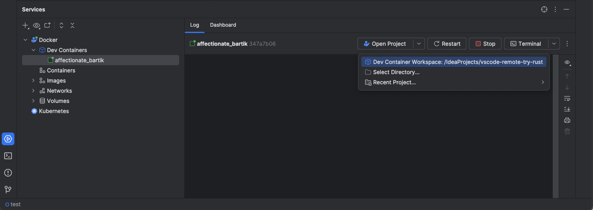
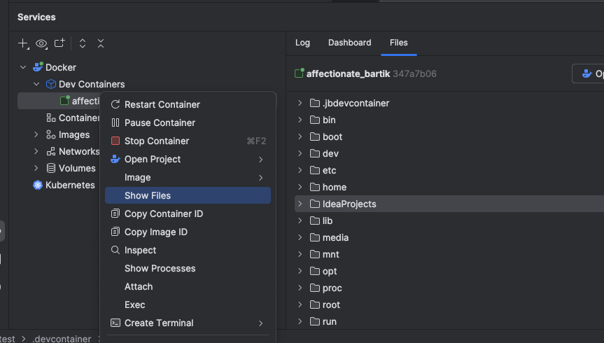
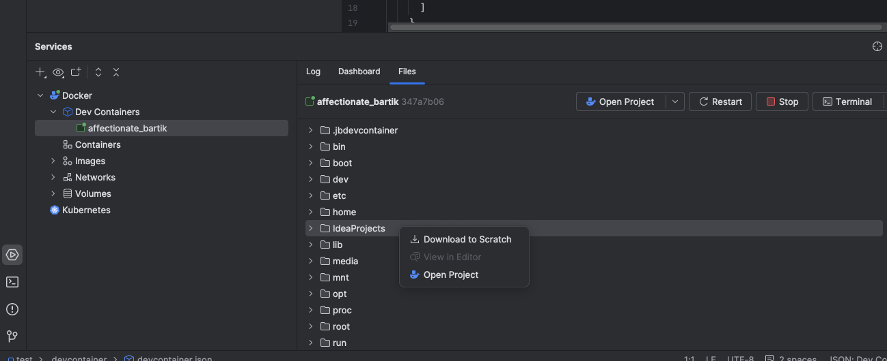

# Opening Projects with EelApi

This document explains how to open projects in different environments (WSL and Docker) using the Eel API.

## Table of Contents

1. [Introduction](#introduction)
2. [Opening WSL Projects](#opening-wsl-projects)
3. [Opening Docker Projects](#opening-docker-projects)
4. [Configuration Options](#configuration-options)
5. [Comparison with Traditional Approaches](#comparison-with-traditional-approaches)

## Introduction

The Eel API provides a unified way to interact with different execution environments, such as the local machine, Docker containers, and WSL distributions. One of the key features of EelApi is the ability to open projects located in these environments directly in IntelliJ IDEA, providing a seamless development experience.

## Opening WSL Projects

Opening projects in Windows Subsystem for Linux (WSL) with EelApi is straightforward. You can simply open a WSL project as if it were a local project.

### How It Works

1. Navigate to the WSL path using the UNC format: `\\wsl$\<distribution_name>\path\to\project` or `\\wsl.localhost\<distribution_name>\path\to\project`
2. Open the project as you would any local project (File > Open)
3. IntelliJ IDEA automatically detects that the project is in a WSL distribution and uses EelApi to interact with it

### Benefits of EelApi for WSL Projects

While WSL project opening was available before EelApi, the new implementation provides several advantages:

- **Improved Stability**: More robust handling of file system operations
- **Better Performance**: Up to 30% faster file system access compared to using the Windows file system API
- **No Freezes**: Eliminates the freezes that often occur when working with WSL file systems
- **Reduced Latency**: Optimized file operations reduce the latency when reading and writing files

## Opening Docker Projects

Traditionally, the only way to open a project in a Docker container was to use Remote Development, which is resource-intensive and doesn't provide a local-like experience. With EelApi, you can now open Docker projects as if they were local projects.

### Prerequisites

To open Docker projects using EelApi, you need to enable certain VM options and registry keys:

1. Add the VM option `-Djbr.java.io.use.nio=true` to your IDE configuration
2. Enable the following registry keys:
   - `open.docker.projects.using.eel=true`
   - `use.eel.file.watcher=true`

Additional registry keys that improve the experience:
- `git.use.eel.for.non.local.project=true`
- And other registry keys for specific subsystems

### Opening a Docker Project

You can open a dev container project using the "Open Project" action:

or you can open any folder in a Docker container as a project:

1. Open the Docker tool window in IntelliJ IDEA
2. Navigate to the container you want to work with
3. Go to the Files tab on the container
4. Right-click on the folder you want to open as a project
5. Select "Open as Project"

### How It Works

When the `open.docker.projects.using.eel=true` flag is enabled, IntelliJ IDEA stops using the client-backend approach for Docker projects. Instead, it opens the project as if it were local, using EelApi to handle all interactions with the Docker container.

This approach provides several benefits:
- **Lightweight**: No need for a heavy backend process
- **Resource-Efficient**: Uses fewer system resources
- **Local-Like Experience**: The project behaves like a local project, with all the IDE features available

## Comparison with Traditional Approaches

### WSL Projects

| Feature | Traditional Approach | EelApi Approach |
|---------|---------------------|-----------------|
| Opening Method | Open as local project | Open as local project |
| Performance | Slower file system access | Up to 30% faster file system access |
| Stability | Occasional freezes | No freezes |
| Feature Support | Full IDE features | Full IDE features |

### Docker Projects

| Feature | Remote Development | EelApi Approach |
|---------|-------------------|-----------------|
| Resource Usage | High (client-backend) | Low (direct access) |
| Setup Complexity | Complex | Simple |
| Performance | Slower due to client-backend communication | Faster direct access |
| Local Experience | Limited | Full local-like experience |
| Feature Support | Limited by client-backend | Full IDE features |

## Conclusion

EelApi provides a seamless way to open and work with projects in different environments, particularly WSL and Docker. By enabling the appropriate options, you can enjoy a local-like development experience with projects located in these environments, with better performance and resource efficiency.