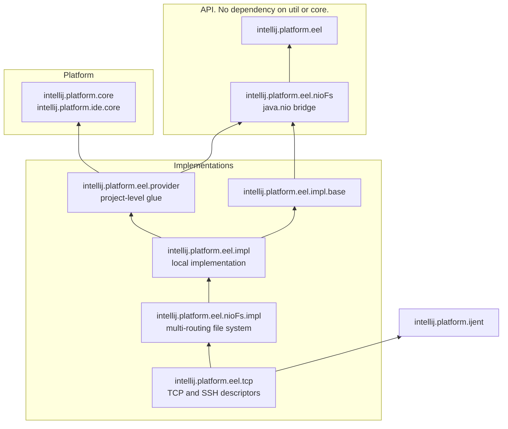

# Eel Module Layout

This page lists the Eel modules in `community/platform/` and states where new code goes. The `*.iml` files are the source of truth. This page summarizes them.

## Modules

| Module | Directory | Content |
| --- | --- | --- |
| `intellij.platform.eel` | `eel/src/`, `eel/gen-builders/` | The public API: `EelApi`, `EelDescriptor`, `EelExecApi`, `EelFileSystemApi`, `EelTunnelsApi`, `EelPath`, `LocalEelApi`, `LocalEelDescriptor`. `gen-builders/` holds generated argument builders. |
| `intellij.platform.eel.nioFs` | `eel-nioFs/src/` | The bridge between the Eel API and `java.nio.file`: `EelPathDescriptor`, path conversion (`asEelPath`, `asNioPath`), `EelNioFsBackend`, `EelFiles`. |
| `intellij.platform.eel.provider` | `eel-provider/src/` | Project-level glue: `Project.getEelDescriptor()`, `getEelMachine()`, project-scoped temp files and system folders, remote-dev host paths, blocking wrappers. |
| `intellij.platform.eel.impl.base` | `eel-impl-base/src/` | Implementation pieces shared by every Eel provider. It depends only on the API and `eel.nioFs`. |
| `intellij.platform.eel.impl` | `eel-impl/src/`, `eel-impl/resources/` | The local Eel implementation and the platform services: `LocalEelApi` for the IDE host, file chooser support, settings. |
| `intellij.platform.eel.nioFs.impl` | `eel-nioFs-impl/src/`, `eel-nioFs-impl/resources/` | The multi-routing file system backend that routes `nio.Path` operations to an Eel provider. |
| `intellij.platform.eel.tcp` | `eel-tcp/src/`, `eel-tcp/resources/` | The TCP and SSH descriptors and machines that connect to an IJent over the network. It depends on `intellij.platform.ijent`. |
| `intellij.platform.eel.codegen` | `eel/codegen/` | `BuildersGeneratorTest`. It generates the argument builders in `gen-builders/`. See [Testing](testing.md). |

Test modules: `intellij.platform.eel.tests` (`eel/tests/`) and `intellij.platform.eel.testFramework` (`eel/testFramework/src/`). See [Testing](testing.md).

## Dependency Direction

An arrow means "depends on". The diagram shows only the direct dependencies between the Eel modules and the platform modules that matter for placement.

`intellij.platform.eel` and `intellij.platform.eel.nioFs` sit below `util` and `core` in the module graph. The API cannot depend on `core`.

## Where New Code Goes

- **API** goes to `intellij.platform.eel` or `intellij.platform.eel.nioFs`. The API cannot depend on `core`, so it must stay in these two modules.
- **Implementations** go to `intellij.platform.eel.impl` or `intellij.platform.eel.impl.base`.
- **Do not add new code to `intellij.platform.eel.provider` by default.** It is one of the first Eel modules. More than 200 modules depend on it, so it cannot be removed. It holds only the project-level glue listed above. See `community/platform/eel-provider/README.md`.
- **IJent-specific code** goes to `community/platform/ijent/` or, for ultimate features such as SSH and WSL, to `platform/ijent/`. In an ultimate checkout, see `platform/ijent/docs/internal/module-layout.md`.

## Generated Builders

Methods with a single argument annotated by `@GeneratedBuilder` get a fluent builder. `BuildersGeneratorTest` in `intellij.platform.eel.codegen` generates these builders into `eel/gen-builders/`. Run the test after you change such a method, then commit the new builders. See the KDoc on `com.intellij.platform.eel.GeneratedBuilder`.
