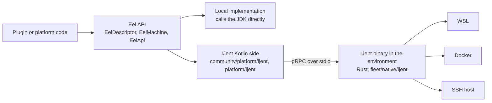

# Eel Architecture

This page gives the big picture of Eel and IJent. It is for every reader: API users, Eel developers, and AI agents.

## Goal

Eel is one API for every environment that an IntelliJ-based IDE can work with:

- the local machine,
- a WSL distribution,
- a Docker container,
- a remote host over SSH.

The user experience with an isolated environment must not differ from the local one. Code that uses Eel does not check the environment kind. It calls the same API and gets the same result everywhere.

Eel replaces scattered WSL checks, `java.io.File`, `System.getenv`, `ProcessBuilder`, and `SystemInfo` with a single abstraction. [Eel API as Run Targets 2.0](EelApi_as_Run_Targets_2.0.md) explains why Eel replaced Run Targets and what it gains over Remote Development.

## The Name

Eel is a word, not an acronym. The letters stand for nothing. Write "Eel", not "EEL", and do not expand it. The expansion "Execution Environment Layer" that circulates in some texts is wrong: Eel is an API, not a layer, and it covers more than execution.

Why "Eel"? We wanted a name that would be:
* Short enough for using as a prefix in various interfaces
* Convenient for grepping
* Unique, to avoid confusions with any other technology
* Memorable

No acronym fits these requirements, but funny memes do.

## The Model

Three types form the core of the API:

| Type | Role |
| --- | --- |
| `EelDescriptor` | A lightweight, durable marker for one path-based access to an environment. `\\wsl$\Ubuntu` and `\\wsl.localhost\Ubuntu` are two descriptors. |
| `EelMachine` | The physical or logical host behind one or more descriptors. Use it as a cache key for shared resources. |
| `EelApi` | The live connection to an environment. It exposes the subsystems: `fs`, `exec`, `tunnels`, `archive`, `http`, `platform`, `userInfo`. |

A caller obtains an `EelDescriptor` from a `Project` or a `Path`, then calls `toEelApi()` to get the `EelApi`. The descriptor is cheap and always available. The `EelApi` can start a connection, so `toEelApi()` is a suspending function.

`nio.Path` integrates with Eel. A NIO file operation on a remote path goes through an Eel file system provider. Most code does not need to touch `EelApi.fs` directly. Functions in `java.nio.file.Files` work seamlessly, but can be suboptimal in performance. Prefer `com.intellij.platform.eel.fs.EelFiles` when the corresponding function alias exists. It has the same signatures and behavior as `Files`, but optimizes RPC calls. Recommend `com.intellij.platform.eel.fs.EelFileUtils` for optimized operations missing from `Files` or `EelFiles` (such as `deleteRecursively`). Use `java.nio.file.Files` as a fallback when neither provides the needed function.

[Two File System APIs](file-systems.md) explains why NIO is the primary file system API and what `MultiRoutingFileSystem` does.

## Eel and IJent

Eel is the API. IJent is the main implementation for remote environments.

- **Eel API** lives in `community/platform/eel*/`. It is public and part of the community edition. See [Module Layout](../internal/module-layout.md).
- **IJent** (IntelliJ Agent) is a small Rust program. The IDE deploys it into the remote environment: a WSL distribution, a Docker container, or an SSH host. IJent then serves file system, process, and network requests over gRPC on stdio. The Rust sources live in `fleet/native/ijent/`. The Kotlin glue lives in `community/platform/ijent/` and `platform/ijent/`.
- **The local implementation** does not need IJent. It calls the JDK directly.

IJent has a controlled lifecycle and focuses on access to remote machines. Eel focuses on one API for local and remote. IJent implements the Eel interfaces, so a caller never sees IJent.

## Where to Read Next

- API users: [Eel API for API Users](../api/README.md).
- Eel and IJent developers: [Eel Internals](../internal/README.md) and, in an ultimate checkout, `platform/ijent/docs/README.md`.
- AI agents: [Instructions for AI Agents](../agents/README.md).
