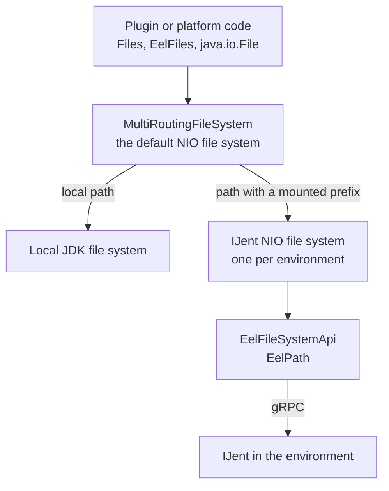

# Two File System APIs

Eel gives two ways to reach a file in an environment. This page explains what each way is, which one is the primary one, and why. It is for every reader.

| API | Path type | Status |
| --- | --- | --- |
| `java.nio.file` through `MultiRoutingFileSystem` | `java.nio.file.Path` | The primary API. New code uses it. |
| `EelFileSystemApi` | `EelPath` | Semi-frozen. `@ApiStatus.Internal`. We do not invest in it. |

## The Decision

Eel was created to add remote environments to code that already exists. That code uses `java.io.File` and `java.nio.file` everywhere. Eel had two options:

1. Support two file system APIs and keep them in sync.
2. Focus on one API.

We chose the second option, and the one API is NIO. The JetBrains Runtime routes `java.io.File` through NIO as well. So one API covers the old code and the new code.

This decision is not carved in stone. If a use case needs the low-level API, write to `#ij-eel` first.

## EelFileSystemApi

`EelFileSystemApi` is a direct call to the local file system or to IJent. `EelApi.fs` returns it.

It operates with `EelPath`. An `EelPath` is always a path on the target machine. For a WSL distribution it is `/home/user`, not `\\wsl$\Ubuntu\home\user`. See [EelPath and nio Path](../api/eel-path-and-nio-path.md).

`EelFileSystemApi` is the engine behind a routed NIO path. The IJent NIO provider implements every `Files` call on top of it. So a caller reaches `EelFileSystemApi` through NIO in most cases, and does not call it directly.

The API is in a semi-frozen state. Bug fixes and the needs of the NIO provider drive its changes. Feature requests do not.

## NIO and MultiRoutingFileSystem

`MultiRoutingFileSystem` is a file system with bind mounts. It owns the local file system and mounts other file systems under path prefixes:

| Prefix | Mounted file system |
| --- | --- |
| `\\wsl.localhost\Ubuntu\`, `\\wsl$\Ubuntu\` | The IJent file system of the WSL distribution `Ubuntu` |
| `\\docker.ij\<id>@<endpoint>\` on Windows, `/$docker.ij/<id>@<endpoint>/` on Unix | The IJent file system of a Docker container |
| Every other path | The local file system of the JDK |

`MultiRoutingFileSystemProvider` is the default file system provider in IntelliJ. `FileSystems.getDefault()` returns `MultiRoutingFileSystem`. That is how `Path.of(...)` and `Paths.get(...)` resolve a path on a remote machine.

`MultiRoutingFileSystem` is an internal class. Know that it exists, but do not operate with it directly. Call `java.nio.file.Files`, `EelFiles`, and `EelFileUtils` on a `Path`, and the routing happens under the hood.

There is no analog of `MultiRoutingFileSystem` for `EelFileSystemApi`. The bind mounts work only with NIO. An `EelPath` carries its `EelDescriptor` instead of a prefix.

## The Layers

## NIO Without MultiRoutingFileSystem

An IJent NIO file system can be used directly, without the bind mount. A path from such a file system looks like `/home/user`, not `\\wsl$\Ubuntu\home\user`. Tests use this mode. It is an advanced mode. [NIO Routing Internals](../internal/nio-routing.md) explains how to open such a file system.

## Where to Read Next

- API users: [EelPath and nio Path](../api/eel-path-and-nio-path.md), then [Path Conversion](../api/EelApi_Path_Conversion.md) and [NIO Integration](../api/EelApi_NIO_Integration.md).
- Eel and IJent developers: [NIO Routing Internals](../internal/nio-routing.md).
