## How to use

Please make sure to check out the `Known limitations and issues` section at the end of this guide.

### Run Multiple Projects

There is a new project context menu item called `Run multiple projects`. It can be used on solutio-level, project-level or in multi-selection mode
to select multiple projects at once:

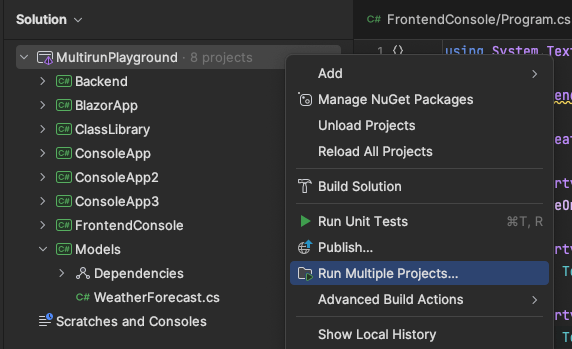

After clicking on it, a new dialog will be shown. It allows to preselect projects that should be included in a multi-run:

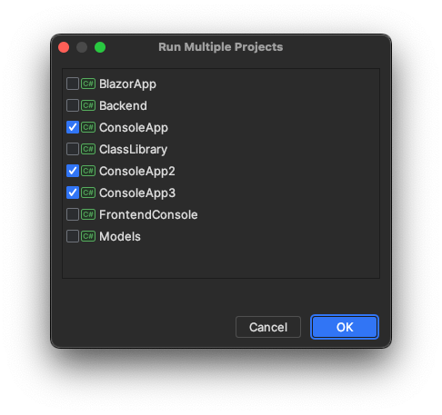

> **Note: in case you already have a Multi-Launch Configuration created**, instead of that dialog Run Multiple Project will proceed to the Edit Configurations dialog for the first found Multi-Run Configuration.

After clicking OK, newly created configuration will be opened for editing:

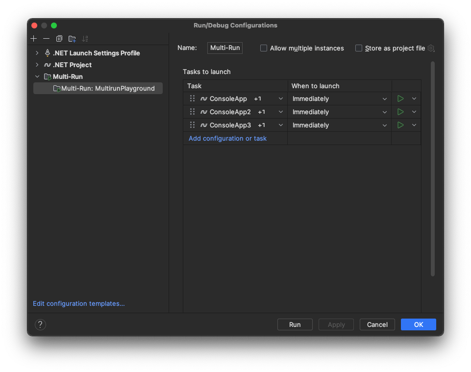

> **Note: if there is no existing configuration for particular runnable project**, it will be generated automatically. For projects that may have multiple configurations (i.e. launchSettings profiles) then all default configs will be created, but the most promising in terms of priority will be chosen for Multi-Launch.

### Manually creating Multi-Launch Configuration

Multi-Launch could be created as any other run configuration - from `Edit Run Configurations` dialog:

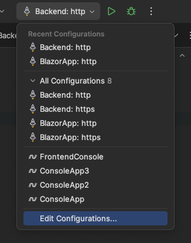

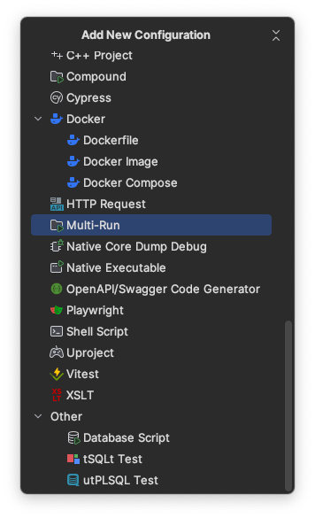

### "Tasks to launch" table overview

The table represents complete information about things that could be executed at some particular time:
1. **Task**: an executable that could be executed. Examples: Run configurations, Publish solution. Answers the question __what__
2. **When to launch**: a condition for running executables. Examples: Immediately, After previous finishes. Anwsers the question __when__
3. **Execution mode**: a runner that should be used for running the executable. Run or Debug for run configurations, empty if not applicable. Answers the question __how__

### Adding tasks

Task could be a run configuration, build-related entity or any other custom executable, provided by plugin:

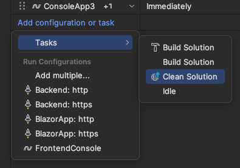
> **Note**: a particular run configuration could be added only once in the same Multi-Launch configuration. Other task types could be added multiple times.

Also it's possible to add multiple tasks at once, using `Add multiple...` from the above popup:
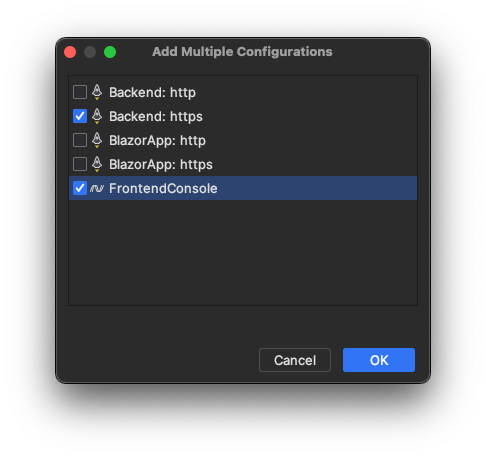

### Reordering

Use drag-and-drop to reorder rows in the column:

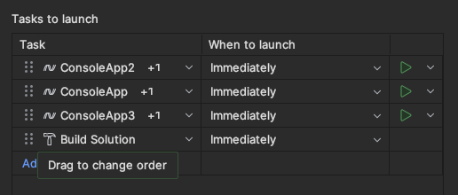

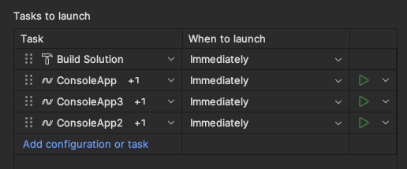

### Before launch tasks overview

If you hover the mouse over `+1` label near each tasks' name, you will see a quick overview of before run tasks that will be executed for each task:

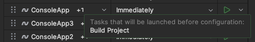

### Controlling "When to launch" behavior

Each task/executable should have a condition that describes when it will be executed.
By default, all added tasks will be executed immediately, but then it could be customized:

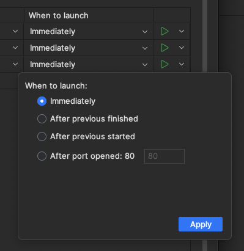

Don't forget to press `Apply` to save changed made in that popup.

As with tasks, conditions could be added in plugins using extension points.

### Execution mode

The last column represents the runner that will be used to execute the task.

For run-configurations it may be Run/Debug (if applicable), for other tasks in common case it should be empty.

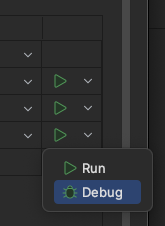

### Executing Multi-Launch configuration

To execute multi-run, use the play button in the main toolbar.

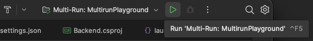

> **Note**: please don't be confused with disabled Debug button. Tasks inside Multi-Launch Configurations are respecting only their own execution mode, configured via third table column.

### Track Multi-Launch execution

The state of execution for a particular Multi-Launch configuration is available under `Services` tool window. There you can track status of each task:

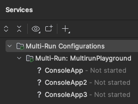

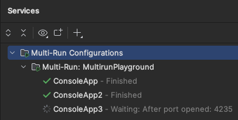

Possible task states:
- **Not started** means that run configuration wasn't started yet in the current IDE session.
- **Waiting** means that task is waiting to satisfy configured condition.
- **Running** means that task started executing.
- **Finished** means that task finished execution.
- **Cancelled** means that task has been canceled. (_not implemented yet_)
- **Failed** means that task has been failed during execution. 

## Known limitations and issues

- Some run configuration types can't be added as tasks due to specific complexity of validation mechanism and/or because of recursion:
  - Compound type
  - Other Multi-Launch Configurations
- The same run configuration can't be added twice in the same Multi-Launch Configuration. However, other task types have no limits for uniqueness and can be added multiple times.
- If you're adding run configurations while configuring Multi-Launch Configuration, you should hit Apply. Only after that they will be accessible in `Add task or configuration` popup.
- **Some configurations may stuck in Running status**. It means that we can't detect configuration lifetime properly (the most common reason - the configuration doesn't have a startable process handler) and we need to adjust the configuration's logic for particular case. 
- ~~**There is no cancellation** of Multi-Launch execution at that point, but it will be addressed before the release. If your task stuck on Waiting state, please restart IDE.~~
- **There is no validations for edge cases yet**. Example ones:
    1. ~~If you add some run configuration then delete it, it may lead to exceptions and will remove the entry from the Multi-Launch Configuration on Apply.~~
    2. ~~If you add some run configuration then edit its name, the same behavior as in the item above.~~
    3. ~~If you add some task and then remove its definition in code, it will break the Multi-Launch Configuration.~~
    4. ~~If you set some condition and then remove its definition in code, it will break the Multi-Launch Configuration.~~
- ~~**After port opened condition** has a number of retries and timeout, if port will not be opened then the task will stick in Waiting state with an exception in logs. Will be fixed when cancellation will be implemented~~
