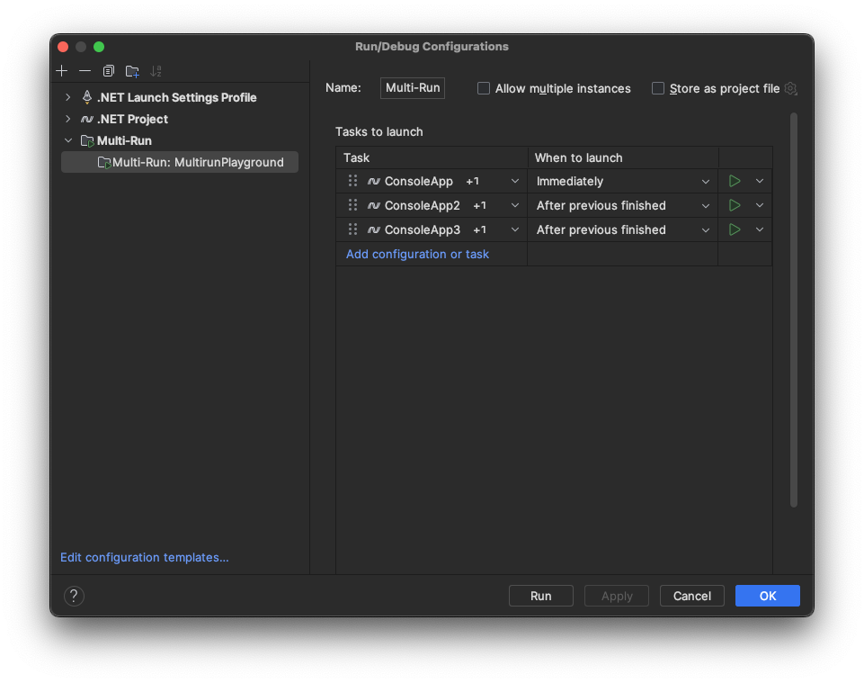

# Multi-Launch Configurations

A run configuration type that allows a more advanced setup for running multiple modules/projects.

## Getting started

Please check out the [How to use](docs/how-to-use.md) guide.

## Guides

- [How to use](docs/how-to-use.md)
- [Implementation overview](docs/multirun-overview.md)
- [Extension points](docs/extension-points.md)

## Useful links

- Figma board: [Link](https://www.figma.com/file/E2Fa691RbhIsTjk1It2ShE/Multiple-Startup-Projects?type=design&node-id=0%3A1&mode=design&t=MKRzaMXcAoiI98lS-1)
- Slack channel: [`#multiple-startup-projects`](https://jetbrains.slack.com/archives/C01V0A0845T)
- YouTrack main ticket: [`RIDER-7033/Multiple-startup-projects`](https://youtrack.jetbrains.com/issue/RIDER-7033/Multiple-startup-projects)