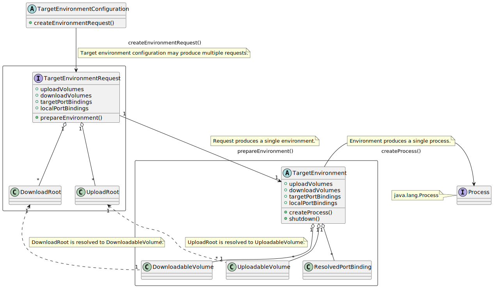

API is located within `com.intellij.execution.target` package in `intellij.platform.execution` module.

The implementation of a specific target is located in a module related to the target. For example, the implementations of Docker and Docker
Compose targets are located in `intellij.clouds.docker.remoteRun` module.

# Class Diagram



<details>
<summary>
The class diagram is generated based on PlantUML description.
</summary>

```
@startuml
  abstract class TargetEnvironmentConfiguration {
    + createEnvironmentRequest()
  }

  package "" <<Rectangle>> {
    interface TargetEnvironmentRequest {
      + uploadVolumes
      + downloadVolumes
      + targetPortBindings
      + localPortBindings
    
      + prepareEnvironment()
    }
    class DownloadRoot
    class UploadRoot
    TargetEnvironmentRequest "1" o-- "*" DownloadRoot
    TargetEnvironmentRequest "1" o-- "*" UploadRoot
  }

  TargetEnvironmentConfiguration  --> TargetEnvironmentRequest : createEnvironmentRequest()
  note on link: Target environment configuration may produce multiple requests.

  package "" <<Rectangle>> {
    abstract class TargetEnvironment {
      + uploadVolumes
      + downloadVolumes
      + targetPortBindings
      + localPortBindings
      
      + createProcess()
      + shutdown()
    }
    class UploadableVolume
    class DownloadableVolume
    class ResolvedPortBinding
    TargetEnvironment "1" o-- "*" DownloadableVolume
    TargetEnvironment "1" o-- "*" UploadableVolume
    TargetEnvironment "1" o-- "*" ResolvedPortBinding
  }

  TargetEnvironmentRequest "1" -right-> "1" TargetEnvironment : prepareEnvironment()
  note top on link: Request produces a single environment.

  DownloadRoot "1" <.. "1" DownloadableVolume
  note on link: DownloadRoot is resolved to DownloadableVolume.
  UploadRoot "1" <.. "1" UploadableVolume
  note on link: UploadRoot is resolved to UploadableVolume.
  
  interface Process
  note left: java.lang.Process

  TargetEnvironment -right-> Process : createProcess()
  note top on link: Environment produces a single process.
@enduml
```

</details>

# Preparing the request

Interface: `TargetEnvironmentRequest`.

At this stage, the user specifies resources that must be available on the target for the process. Note that if the process does not require
any resources to be managed by the target, the configuration on this step would be empty.

## Volumes

API provides two main types of volumes: upload and download.

### Upload Volumes

Interface: `TargetEnvironment.UploadableVolume`.

Typical usages:

- Resources directly related to the application developed by the user.
  - Project files for interpreted languages.
  - Build artifacts. For example, JAR files for Java projects or an executable produced by Go compiler.
- IDE helper resources required for the execution.
  - Debug/profile scripts.

#### Data Persisting

##### Upload

The `hint` might be assigned to `targetRootPath` of `UploadRoot`. A target implementation may reuse previously created directories for the
same hint and optimize the upload of the files to this directory.

##### Download

An identifier might be assigned to a download volume (the field `DownloadRoot.persistentId`). The target implementation is responsible for
handling the volumes of the same identifier within different request optimally. Practically, the target path for volumes with a same
identifier would be preserved and the upload path on the target would not be changed.

### Download Volumes

Interface: `TargetEnvironment.DownloadableVolume`.
Used for receiving the artifacts on the target machine generated by the process:

- Coverage results.
- Project structure produced by a generator. For example, a Django project generated by `django-admin startproject` command.

### External Volumes

Targets API currently does not provide a unified way to keep track of volumes that are synchronized externally.

As a target developer, if the target essentially binds some files and directories from the local machine to the target, consider
constructing the corresponding volumes and adding them to `TargetEnvironment.uploadVolumes` or `TargetEnvironment.downloadVolumes` on
creating `TargetEnvironment` itself.

## Port bindings

# Initializing the environment

This is the call to `TargetEnvironmentRequest.prepareEnvironment(...)`.

# Building the command line

`com/intellij/execution/target/value/TargetEnvironmentFunctions.kt`

# Creating the process

The process is created within the initialized environment via the call `TargetEnvironment.createProcess(...)`. It
takes `TargetedCommandLine` as the argument. *[To be discussed] The call of `TargetEnvironment.createProcess()` is expected to happen once
in the lifetime of the request.*

# Finalizing the work

After the process is finished and the required download volumes are processed, the user should notify the environment that allocated
resources are ready to be disposed by calling `TargetEnvironment.shutdown()` method.