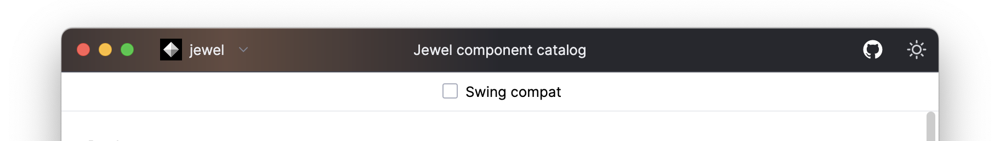

[](https://github.com/JetBrains#jetbrains-on-github) [](https://github.com/JetBrains/jewel/actions/workflows/build.yml) [](https://github.com/JetBrains/jewel/blob/main/LICENSE) [](https://github.com/JetBrains/jewel/releases/latest) ![Compose for Desktop version](https://img.shields.io/badge/Compose%20for%20Desktop-1.6.0-dev1369?logo=data%3Aimage%2Fsvg%2Bxml%3Bbase64%2CPHN2ZyB2aWV3Qm94PSIwIDAgNjcgNzQiIGZpbGw9Im5vbmUiIHhtbG5zPSJodHRwOi8vd3d3LnczLm9yZy8yMDAwL3N2ZyI%2BPHBhdGggZmlsbC1ydWxlPSJldmVub2RkIiBjbGlwLXJ1bGU9ImV2ZW5vZGQiIGQ9Ik0zNS45OTkgMi42NjNhNS4wMSA1LjAxIDAgMCAwLTQuOTk4IDBsLTI2LjUgMTUuMjUzYTQuOTk0IDQuOTk0IDAgMCAwLTEuMTk4Ljk2MmwxMS4xMDggNi4zNjZjLjI2OC0uMjkuNTgtLjU0LjkzMS0uNzQ0bDE2LjE1Ni05LjM0MmE0IDQgMCAwIDEgNC4wMDQgMEw1MS42NTcgMjQuNWMuMzUxLjIwMy42NjQuNDU1LjkzMi43NDRsMTEuMTA4LTYuMzY2YTQuOTkxIDQuOTkxIDAgMCAwLTEuMTk4LS45NjJsLTI2LjUtMTUuMjUzWm0yOC43MjMgMTcuOTMzLTExLjE4MyA2LjQwOGMuMDc2LjMxLjExNi42MzIuMTE2Ljk1OXYxNy43OTRhNCA0IDAgMCAxLTEuOTU4IDMuNDRsLTE2LjIzNSA5LjYzOGEzLjk5OCAzLjk5OCAwIDAgMS0uOTYyLjQxMnYxMi42M2E1LjAwNSA1LjAwNSAwIDAgMCAxLjQyOC0uNTY5bDI2LjYyLTE1LjczQTQuOTg2IDQuOTg2IDAgMCAwIDY1IDUxLjI4NFYyMi4yMzdjMC0uNTY3LS4wOTctMS4xMi0uMjc4LTEuNjRaTTIgMjIuMjM3YzAtLjU2Ny4wOTctMS4xMi4yNzgtMS42NGwxMS4xODMgNi40MDdjLS4wNzYuMzEtLjExNi42MzItLjExNi45NTl2MTguNjMzYTQgNCAwIDAgMCAyLjA4IDMuNTA5bDE2LjA3NCA4LjhjLjMyLjE3NC42NTYuMzAyIDEuMDAxLjM4NHYxMi42MzhhNS4wMDUgNS4wMDUgMCAwIDEtMS41MTctLjUzM0w0LjYwMyA1Ny4wMkE0Ljk4NyA0Ljk4NyAwIDAgMSAyIDUyLjY0MlYyMi4yMzdaTTMwLjAwMi45MzVhNy4wMTQgNy4wMTQgMCAwIDEgNi45OTYgMGwyNi41IDE1LjI1M0E2Ljk4IDYuOTggMCAwIDEgNjcgMjIuMjM4djI5LjA0N2E2Ljk4IDYuOTggMCAwIDEtMy40MzMgNi4wMDlsLTI2LjYyIDE1LjczMWE3LjAxNCA3LjAxNCAwIDAgMS02LjkyMy4xMkwzLjY0NCA1OC43NzFBNi45ODEgNi45ODEgMCAwIDEgMCA1Mi42NDFWMjIuMjM4YTYuOTggNi45OCAwIDAgMSAzLjUwMi02LjA1TDMwLjAwMi45MzZabS04LjYwNCAyNy41NTIgMTAuNTgyLTYuMTFjLjk0LS41NDIgMi4xLS41NDIgMy4wNCAwbDEwLjU4MiA2LjExYTIuOTk2IDIuOTk2IDAgMCAxIDEuNTAzIDIuNTkzdjExLjY1M2MwIDEuMDU2LS41NiAyLjAzNC0xLjQ3MyAyLjU3NmwtMTAuNjQzIDYuMzA4YTMuMDQ0IDMuMDQ0IDAgMCAxLTMuMDA5LjA1MmwtMTAuNTItNS43NWEyLjk5NiAyLjk5NiAwIDAgMS0xLjU2NS0yLjYyN1YzMS4wOGMwLTEuMDY4LjU3My0yLjA1NiAxLjUwMy0yLjU5M1oiIGZpbGw9IiNmZmYiLz48L3N2Zz4%3D)


# Jewel: a Compose for Desktop theme


Jewel aims at recreating the IntelliJ Platform's _New UI_ Swing Look and Feel in Compose for Desktop, providing a
desktop-optimized theme and set of components.

> [!WARNING]
>
> This project is in active development, and caution is advised when considering it for production uses. You _can_ use
> it, but you should expect APIs to change often, things to move around and/or break, and all that jazz. Binary
> compatibility is not guaranteed across releases, and APIs are still in flux and subject to change.
>
> Writing 3rd party IntelliJ Plugins in Compose for Desktop is currently **not officially supported** by the IntelliJ
> Platform. It should work, but your mileage may vary, and if things break you're on your own.
>
> Use at your own risk!

Jewel provides an implementation of the IntelliJ Platform themes that can be used in any Compose for Desktop
application. Additionally, it has a Swing LaF Bridge that only works in the IntelliJ Platform (i.e., used to create IDE
plugins), but automatically mirrors the current Swing LaF into Compose for a native-looking, consistent UI.

## Getting started

To use Jewel in your app, you only need to add the relevant dependency. There are two scenarios: standalone Compose for
Desktop app, and IntelliJ Platform plugin.

For now, Jewel artifacts aren't available on Maven Central. You need to add a custom Maven repository to your build:

```kotlin
repositories {
    maven("https://packages.jetbrains.team/maven/p/kpm/public/")
    // Any other repositories you need (e.g., mavenCentral())
}
```

If you're writing a **standalone app**, then you should depend on the `int-ui-standalone` artifact:

```kotlin
dependencies {
    implementation("org.jetbrains.jewel:jewel-int-ui-standalone:[jewel version]")

    // Optional, for custom decorated windows:
    implementation("org.jetbrains.jewel:jewel-int-ui-decorated-window:[jewel version]")
}
```

For an **IntelliJ Platform plugin**, then you should depend on the appropriate `ide-laf-bridge` artifact:

```kotlin
dependencies {
    // The platform version is a supported major IJP version (e.g., 232 or 233 for 2023.2 and 2023.3 respectively)
    implementation("org.jetbrains.jewel:jewel-ide-laf-bridge:[jewel version]-ij-[platform version]")
}
```
<br/>

> [!TIP]
> <a href="https://www.droidcon.com/2023/11/15/meet-jewelcreate-ide-plugins-in-compose/">
> 
> </a>
>
> If you want to learn more about Jewel and Compose for Desktop and why they're a great, modern solution for your desktop
> UI needs, check out [this talk](https://www.droidcon.com/2023/11/15/meet-jewelcreate-ide-plugins-in-compose/) by Jewel
> contributors Sebastiano and Chris.
>
> It covers why Compose is a viable choice, and an overview of the Jewel project, plus
> some real-life use cases.<br clear="left" />

<br/>

## Project structure

The project is split in modules:

1. `buildSrc` contains the build logic, including:
    * The `jewel` and `jewel-publish` configuration plugins
    * The `jewel-check-public-api` and `jewel-linting` configuration plugins
    * The Theme Palette generator plugin
    * The Studio Releases generator plugin
2. `foundation` contains the foundational Jewel functionality:
    * Basic components without strong styling (e.g., `SelectableLazyColumn`, `BasicLazyTree`)
    * The `JewelTheme` interface with a few basic composition locals
    * The state management primitives
    * The Jewel annotations
    * A few other primitives
3. `ui` contains all the styled components and custom painters logic
4. `decorated-window` contains basic, unstyled functionality to have custom window decoration on the JetBrains Runtime
5. `int-ui` contains two modules:
    * `int-ui-standalone` has a standalone version of the Int UI styling values that can be used in any Compose for
      Desktop app
    * `int-ui-decorated-window` has a standalone version of the Int UI styling values for the custom window decoration
      that can be used in any Compose for Desktop app
6. `ide-laf-bridge` contains the Swing LaF bridge to use in IntelliJ Platform plugins (see more below)
    * The `ide-laf-bridge-*` sub-modules contain code that is specific to a certain IntelliJ Platform version
7. `samples` contains the example apps, which showcase the available components:
    * `standalone` is a regular CfD app, using the standalone theme definitions and custom window decoration
    * `ide-plugin` is an IntelliJ plugin that showcases the use of the Swing Bridge

### Int UI Standalone theme

The standalone theme can be used in any Compose for Desktop app. You use it as a normal theme, and you can customise it
to your heart's content. By default, it matches the official Int UI specs.

> [!WARNING]
> Note that Jewel **requires** the JetBrains Runtime to work correctly. Some features like font loading depend on it,
> as it has extra features and patches for UI functionalities that aren't available in other JDKs.
> We **do not support** running Jewel on any other JDK.

To use Jewel components in a non-IntelliJ Platform environment, you need to wrap your UI hierarchy in a `IntUiTheme`
composable:

```kotlin
IntUiTheme(isDark = false) {
    // ...
}
```

If you want more control over the theming, you can use other `IntUiTheme` overloads, like the standalone sample does.

#### Custom window decoration

The JetBrains Runtime allows windows to have a custom decoration instead of the regular title bar.



The standalone sample app shows how to easily get something that looks like a JetBrains IDE; if you want to go _very_
custom, you only need to depend on the `decorated-window` module, which contains all the required primitives, but not
the Int UI styling.

To get an IntelliJ-like custom title bar, you need to pass the window decoration styling to your theme call, and add the
`DecoratedWindow` composable at the top level of the theme:

```kotlin
IntUiTheme(
    themeDefinition,
    componentStyling = {
        themeDefinition.decoratedWindowComponentStyling(
            titleBarStyle = TitleBarStyle.light()
        )
    },
) {
    DecoratedWindow(
        onCloseRequest = { exitApplication() },
    ) {
        // ...
    }
}
```

### The Swing Bridge

Jewel includes a crucial element for proper integration with the IDE: a bridge between the Swing components — theme
and LaF — and the Compose world.

This bridge ensures that we pick up the colours, typography, metrics, and images as defined in the current IntelliJ
theme, and apply them to the Compose components as well. This means Jewel will automatically adapt to IntelliJ Platform
themes that use the [standard theming](https://plugins.jetbrains.com/docs/intellij/themes-getting-started.html)
mechanisms.

> [!NOTE]
> IntelliJ themes that use non-standard mechanisms (such as providing custom UI implementations for Swing components)
> are not, and can never, be supported.

If you're writing an IntelliJ Platform plugin, you should use the `SwingBridgeTheme` instead of the standalone theme:

```kotlin
SwingBridgeTheme {
    // ...
}
```

#### Accessing icons

When you want to draw an icon from the resources, you can either use the `Icon` composable and pass it the resource path
and the corresponding class to look up the classpath from, or go one lever deeper and use the lower level,
`Painter`-based API.

The `Icon` approach looks like this:

```kotlin
// Load the "close" icon from the IDE's AllIcons class
Icon(
    "actions/close.svg",
    iconClass = AllIcons::class.java,
    contentDescription = "Close",
)
```

To obtain a `Painter`, instead, you'd use:

```kotlin
val painterProvider = rememberResourcePainterProvider(
    path = "actions/close.svg",
    iconClass = AllIcons::class.java
)
val painter by painterProvider.getPainter()
```

#### Icon runtime patching

Jewel emulates the under-the-hood machinations that happen in the IntelliJ Platform when loading icons. Specifically,
the resource will be subject to some transformations before being loaded.

For example, in the IDE, if New UI is active, the icon path may be replaced with a different one. Some key colors in SVG
icons will also be replaced based on the current theme. See
[the docs](https://plugins.jetbrains.com/docs/intellij/work-with-icons-and-images.html#new-ui-icons).

Beyond that, even in standalone, Jewel will pick up icons with the appropriate dark/light variant for the current theme,
and for bitmap icons it will try to pick the 2x variants based on the `LocalDensity`.

If you have a _stateful_ icon, that is if you need to display different icons based on some state, you can use the
`PainterProvider.getPainter(PainterHint...)` overload. You can then use one of the state-mapping `PainterHint` to let
Jewel load the appropriate icon automatically:

```kotlin
// myState implements SelectableComponentState and has a ToggleableState property
val myPainter by myPainterProvider.getPainter(
    if (myState.toggleableState == ToggleableState.Indeterminate) {
        IndeterminateHint
    } else {
        PainterHint.None
    },
    Selected(myState),
    Stateful(myState),
)
```

Where the `IndeterminateHint` looks like this:

```kotlin
private object IndeterminateHint : PainterSuffixHint() {
    override fun suffix(): String = "Indeterminate"
}
```

Assuming the PainterProvider has a base path of `components/myIcon.svg`, Jewel will automatically translate it to the
right path based on the state. If you want to learn more about this system, look at the `PainterHint` interface and its
implementations.

### Fonts
To load a system font, you can obtain it by its family name:

```kotlin
val myFamily = FontFamily("My Family")
```

If you want to use a font embedded in the JetBrains Runtime, you can use the `EmbeddedFontFamily` API instead:

```kotlin
import javax.swing.text.StyledEditorKit.FontFamilyAction

// Will return null if no matching font family exists in the JBR
val myEmbeddedFamily = EmbeddedFontFamily("Embedded family")

// It's recommended to load a fallback family when dealing with embedded familes
val myFamily = myEmbeddedFamily ?: FontFamily("Fallback family")
```

You can obtain a `FontFamily` from any `java.awt.Font` — including from `JBFont`s — by using the `asComposeFontFamily()`
API:

```kotlin
val myAwtFamily = myFont.asComposeFontFamily()

// This will attempt to resolve the logical AWT font 
val myLogicalFamily = Font("Dialog").asComposeFontFamily()

// This only works in the IntelliJ Platform, 
// since JBFont is only available there
val myLabelFamily = JBFont.label().asComposeFontFamily()
```

### Swing interoperability

As this is Compose for Desktop, you get a good degree of interoperability with Swing. To avoid glitches and z-order
issues, you should enable the
[experimental Swing rendering pipeline](https://blog.jetbrains.com/kotlin/2023/08/compose-multiplatform-1-5-0-release/#enhanced-swing-interop)
before you initialize Compose content.

The `ToolWindow.addComposeTab()` extension function provided by the `ide-laf-bridge` module will take care of that for
you. However, if you want to also enable it in other scenarios and in standalone applications, you can call the
`enableNewSwingCompositing()` function in your Compose entry points (that is, right before creating a `ComposePanel`).

> [!NOTE]
> The new Swing rendering pipeline is experimental and may have performance repercussions when using infinitely
> repeating animations. This is a known issue by the Compose Multiplatform team, that requires changes in the Java
> runtime to fix. Once the required changes are made in the JetBrains Runtime, we'll remove this notice.

## Written with Jewel
Here is a small selection of projects that use Compose for Desktop and Jewel:
* [Package Search](https://github.com/JetBrains/package-search-intellij-plugin) (IntelliJ Platform plugin)
* [Kotlin Explorer](https://github.com/romainguy/kotlin-explorer) (standalone app)
* ...and more to come!

## Need help?

You can find help on the [`#jewel`](https://app.slack.com/client/T09229ZC6/C05T8U2C31T) channel on the Kotlin Slack.
If you don't already have access to the Kotlin Slack, you can request it
[here](https://surveys.jetbrains.com/s3/kotlin-slack-sign-up).

## License

Jewel is licensed under the [Apache 2.0 license](https://github.com/JetBrains/jewel/blob/main/LICENSE).

```
Copyright 2022–4 JetBrains s.r.o.

Licensed under the Apache License, Version 2.0 (the "License");
you may not use this file except in compliance with the License.
You may obtain a copy of the License at

    http://www.apache.org/licenses/LICENSE-2.0

Unless required by applicable law or agreed to in writing, software
distributed under the License is distributed on an "AS IS" BASIS,
WITHOUT WARRANTIES OR CONDITIONS OF ANY KIND, either express or implied.
See the License for the specific language governing permissions and
limitations under the License.
```
