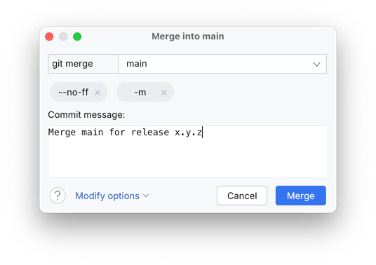

# Releasing new versions of Jewel

The release process is mostly automated, but it requires manual prep steps.

> [!IMPORTANT]
> Don't arbitrarily create releases. Always obtain written go-ahead from @rock3r before cutting a release!

1. Update the Jewel version in [gradle.properties]
2. Commit the change with a message like "Bump version to x.y.z"
3. Ensure that Jewel works correctly in all its parts:
    * Run all tests and checks
    * Run the standalone sample and check _everything_ works as expected (in all themes, with/without Swing compat, ...)
    * Run the IDE sample and check _everything_ works as expected (in all themes)
4. _For every branch in `releases/`_:
   a. Check out the branch
   b. Merge the `main` branch in using the _Merge_ dialog and these options:
   
   c. If needed, solve merge conflicts, as it makes sense
   > [!CAUTION]
   > Merging is the most delicate part. Not all changes need backporting, and not all changes can be
   > backported without adapting to how an older IJP version works. **Triple check all backports!**

   d. Repeat step 3 for this branch
5. Once all branches are ready, run the `:tagRelease` task, which will validate that the merge was done properly, and
   that the version has been bumped
6. Push all the branches and all the new tags
7. Open the [tags page](https://github.com/JetBrains/jewel/tags), select the _base_ tag (e.g., `v1.0.0`, and not any of
   the `v1.0.0-*` sub-tags)
8. Create a release from the tag, using the auto-generated release notes. Add any further information that may be useful
   to users, including any breaking API or behaviour changes
9. Wait for the [publishing CI job](https://github.com/JetBrains/jewel/actions/workflows/publish.yml) to finish running
10. Done!
