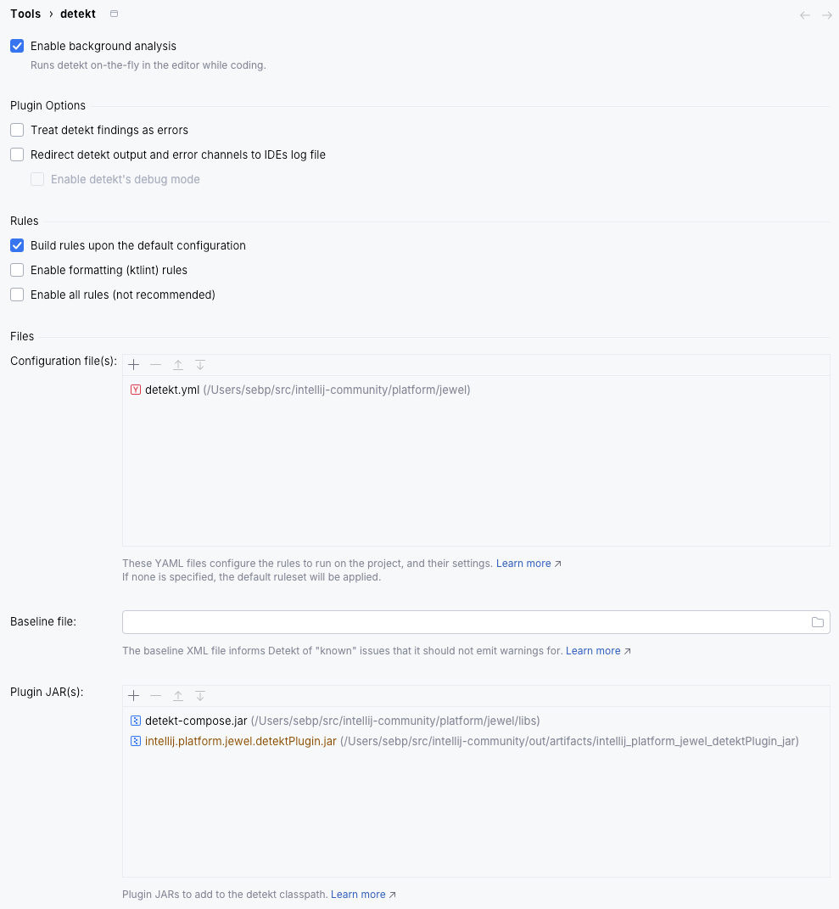

# Detekt Compose rules

This is the Detekt Compose rules JAR. It is used for static analysis in the IDE and by the Gradle build.

Why a jar in the repo? The IDE plugin does not support dynamically getting it from Maven Central, so at this point we
may as well just be using this jar for both the IDE plugin and the Gradle build.

For more info see [this page](https://mrmans0n.github.io/compose-rules/detekt/).
Current rules JAR version: [0.4.26](https://github.com/mrmans0n/compose-rules/releases/tag/v0.4.26)

## Getting findings in the IDE editor

1. Install the [Detekt IntelliJ plugin](https://plugins.jetbrains.com/plugin/10761-detekt)
2. Make sure you've built the [`detekt-plugin`](../detekt-plugin) module. You can either:
   * Right-click the [`detekt-plugin`](../detekt-plugin) module in the _Project_ toolwindow and select _Build Module
     'intellij.platform.jewel.detektPlugin'_, or
   * Use the _Build | Rebuild project_ menu, or
   * Use the _Build | Build Artifacts..._ menu, and select
3. Open [_Settings | Tools | detekt_](jetbrains://idea/settings?name=Tools--detekt)
4. Enable background analysis
5. Point it to the [`detekt.yml`](../detekt.yml) configuration file
6. Add the [`detekt-compose.jar`](detekt-compose.jar) file as a plugin
7. Add the [`intellij.platform.jewel.detektPlugin.jar`](../../../out/artifacts/intellij_platform_jewel_detektPlugin_jar/intellij.platform.jewel.detektPlugin.jar)
   file as a plugin

## Updating the rules

To update the rules JAR:

1. Go to https://github.com/mrmans0n/compose-rules/releases/latest
2. Download the `detekt-compose-[...]-all.jar` file
3. Rename it to `detekt-compose.jar`
4. Replace the file in this folder with the new one
5. Update the version number and link above
