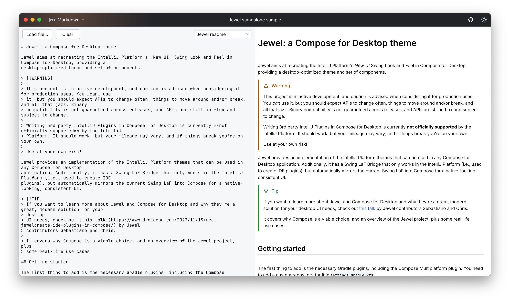

## Jewel Markdown Renderer

> [!IMPORTANT]
> The Jewel Markdown renderer is currently considered **experimental**. Its API and implementations may change at any
> time, and no guarantees are made for binary and source compatibility. It might also have bugs and missing features.

Adds the ability to render Markdown as native Compose UI.

Currently supports the [CommonMark 0.31.2](https://spec.commonmark.org/0.31.2/) specs.

Additional supported Markdown, via extensions:

* Alerts ([GitHub Flavored Markdown][alerts-specs]) — see [`extension-gfm-alerts`](extension/gfm-alerts)
* Autolink (standard CommonMark, but provided as extension) — see [`extension-autolink`](extension/autolink)
* Tables ([GitHub Flavored Markdown](https://github.github.com/gfm/#tables-extension-)) — see [
  `extension-gfm-tables`](extension/gfm-tables)
* Strikethrough ([GitHub Flavored Markdown](https://github.github.com/gfm/#strikethrough-extension-))

[alerts-specs]: https://github.com/orgs/community/discussions/16925

On the roadmap, but not currently supported — in no particular order:

* Image loading (via [Coil 3](https://coil-kt.github.io/coil/upgrading_to_coil3/))
* Task list items ([GitHub Flavored Markdown](https://github.github.com/gfm/#task-list-items-extension-))
* Keyboard shortcuts highlighting (specialized HTML handling)
* Collapsing sections ([GitHub Flavored Markdown][details-specs])
* Theme-sensitive image loading ([GitHub Flavored Markdown][dark-mode-pics-specs])
* Emojis ([GitHub Flavored Markdown][emoji-specs])
* Footnotes ([GitHub Flavored Markdown][footnotes-specs])

[details-specs]: https://docs.github.com/en/get-started/writing-on-github/working-with-advanced-formatting/organizing-information-with-collapsed-sections

[dark-mode-pics-specs]: https://docs.github.com/en/get-started/writing-on-github/getting-started-with-writing-and-formatting-on-github/basic-writing-and-formatting-syntax#specifying-the-theme-an-image-is-shown-to

[emoji-specs]: https://docs.github.com/en/get-started/writing-on-github/getting-started-with-writing-and-formatting-on-github/basic-writing-and-formatting-syntax#using-emojis

[footnotes-specs]: https://docs.github.com/en/get-started/writing-on-github/getting-started-with-writing-and-formatting-on-github/basic-writing-and-formatting-syntax#footnotes

Not supported, and not on the roadmap:

* Inline HTML rendering (except keyboard shortcuts)
* Mermaid diagrams (GitHub Flavored Markdown)
* LaTeX rendering, both inline and not (GitHub Flavored Markdown)
* topoJSON/geoJSON rendering (GitHub Flavored Markdown)
* 3D STL models (GitHub Flavored Markdown)
* Rich rendering of embeds such as videos, YouTube, GitHub Gists/...

## Add the Markdown renderer to your project

The Jewel Markdown renderer is designed to be run in a project that already has a `jewel-int-ui-standalone-*` or
`jewel-ide-laf-bridge-*` dependency. The `core` module doesn't contain any styling, and you're supposed to use either
the `jewel-markdown-int-ui-standalone-styling-*` or `jewel-markdown-ide-laf-bridge-styling-*` instead. They will carry
the necessary dependencies. Make sure to use an artifact with the matching IJP version to what you already have in your
project.

> [!CAUTION]
> Don't use the standalone artifact in an IDE plugin, and don't use the bridge artifact in a standalone project!

If you want to use extensions, you also need to add them **alongside** the `jewel-markdown-core`:

```kotlin
dependencies {
    implementation(libs.jewel.standalone)
    implementation(libs.jewel.markdown.intUiStandaloneStyling)
    implementation(libs.jewel.markdown.extensions.gfm.alerts) // Optional
    // Et cetera...
}
```

## How to use Jewel's Markdown renderer

The process that leads to rendering Markdown in a native UI is two-pass.

The first pass is an upfront rendering that pre-processes blocks into `MarkdownBlock`s, that contain nested blocks and/
or `InlineMarkdown`. It's recommended to run this outside of the composition, since it has no dependencies on it, and
it can be slow, depending on the amount of Markdown to process.

```kotlin
// Somewhere outside of composition — e.g., in a viewmodel or service
val processor = MarkdownProcessor()
val rawMarkdown = "..."
val markdownBlocks: List<MarkdownBlock> = processor.processMarkdownDocument(rawMarkdown)
```

Once you have your list of `MarkdownBlock`s, you can do the second step in the composition: render a series of
`MarkdownBlock`s into native Jewel UI. The easiest way is by using
the [`Markdown`](core/src/main/kotlin/org/jetbrains/jewel/markdown/Markdown.kt) composable:

```kotlin
// We recommend having the Provide call at the theme level
ProvideMarkdownStyling {
    Markdown(markdownBlocks)
}
```

For your convenience, Jewel also provides a variant of the `Markdown` composable that accepts a string instead of the
list of blocks; this is an easier-to-use API, but comes with the compromise of running the processing in the composition
and is as such only advisable for small, never-changing runs of Markdown.

For large Markdown documents, you should use the `LazyMarkdown` composable, which is backed by a `LazyColumn` instead of
a regular `Column`. This should provide better performances, but it is not recommended for small documents, as its
overhead is not justifiable.

### Editor mode

If you're using the Markdown functionality to generate a real-time preview of some raw Markdown in an editor, we
recommend enabling the `editorMode` in the `MarkdownProcessor`, and using a `LazyMarkdown` composable.

A `MarkdownProcessor` in editor mode is optimized for small, incremental edits, such as the ones that happen when the
user is typing. The processor, in this mode, tries to figure out which block(s) have been modified, and only recomputes
those.

> [!CAUTION]
> Never share an instance of `MarkdownProcessor` in editor mode across multiple places! Editor mode is a stateful mode
> that caches its computations, and using it in multiple places will bust the cache and leave you with a worse
> performance.

### Using extensions

By default, the processor will ignore any kind of Markdown it doesn't support. To support additional features, such as
ones found in GitHub Flavored Markdown, you can use extensions. If you don't specify any extension, the processor will
be restricted to the [CommonMark specs](https://specs.commonmark.org) as supported by
[`commonmark-java`](https://github.com/commonmark/commonmark-java).

> [!NOTE]
> Images are not supported yet, even if they are part of the CommonMark specs.
> See https://github.com/JetBrains/Jewel/issues/472 for status updates.

Extensions are composed of two parts: a parsing and a rendering part. The two parts need to be passed to the
`MarkdownProcessor` and `MarkdownBlockRenderer`, respectively. For example, in a standalone project:

```kotlin
// Where the parsing happens...
val parsingExtensions: List<MarkdownProcessorExtension> = listOf(/*...*/)
val processor = MarkdownProcessor(parsingExtensions)

// Where the rendering happens...
val blockRenderer = remember(markdownStyling, isDark) {
    val rendererExtensions = listOf<MarkdownRendererExtension>(/*...*/)

    if (isDark) {
        MarkdownBlockRenderer.dark(rendererExtensions)
    } else {
        MarkdownBlockRenderer.light(rendererExtensions)
    }
}
```

It is strongly recommended to use the corresponding set of rendering extensions as the ones used for parsing, otherwise
the custom blocks will be parsed but not rendered.

Note that you should create `InlineMarkdownRenderer`s with the same list of extensions that was used to build the
block renderer. The `MarkdownBlockRenderer` factory functions take care of this for you, but if you want to provide your
own inline renderer, this is something to be careful about.

### Showcase

You can see this in action running the Standalone sample, and selecting Markdown from the top-left menu.

The following image shows the Jewel Markdown renderer displaying the Jewel readme.


