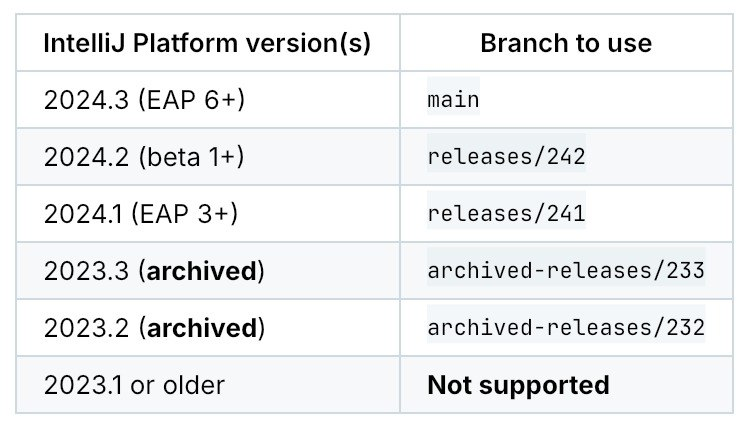
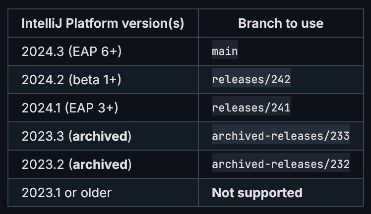

# GitHub Flavored Markdown — tables extension

This extension adds support for tables, a [GFM extension](https://github.github.com/gfm/#tables-extension-) over
CommonMark. Tables are parsed by the `commonmark-ext-gfm-tables` library, and rendered using a themed
[`BasicTableLayout`](../../../foundation/src/main/kotlin/org/jetbrains/jewel/foundation/layout/BasicTableLayout.kt).

The default table styling matches the GitHub styling:

| Light theme                                                             | Dark theme                                                            |
|-------------------------------------------------------------------------|-----------------------------------------------------------------------|
|  |  |

## Usage

To use the tables extension, you need to add the `GitHubTableProcessorExtension` to your `MarkdownProcessor`, and the
`GitHubTableRendererExtension` to the `MarkdownBlockRenderer`. For example, in standalone mode:

```kotlin
val isDark = JewelTheme.isDark

val markdownStyling = remember(isDark) { if (isDark) MarkdownStyling.dark() else MarkdownStyling.light() }

val processor = remember { MarkdownProcessor(listOf(GitHubTableProcessorExtension)) }

val blockRenderer =
    remember(markdownStyling) {
        if (isDark) {
            MarkdownBlockRenderer.dark(
                styling = markdownStyling,
                rendererExtensions = listOf(GitHubTableRendererExtension(GfmTableStyling.dark(), markdownStyling)),
            )
        } else {
            MarkdownBlockRenderer.light(
                styling = markdownStyling,
                rendererExtensions = listOf(GitHubTableRendererExtension(GfmTableStyling.light(), markdownStyling)),
            )
        }
    }

ProvideMarkdownStyling(markdownStyling, blockRenderer, NoOpCodeHighlighter) {
    // Your UI that renders Markdown goes here
}
```
