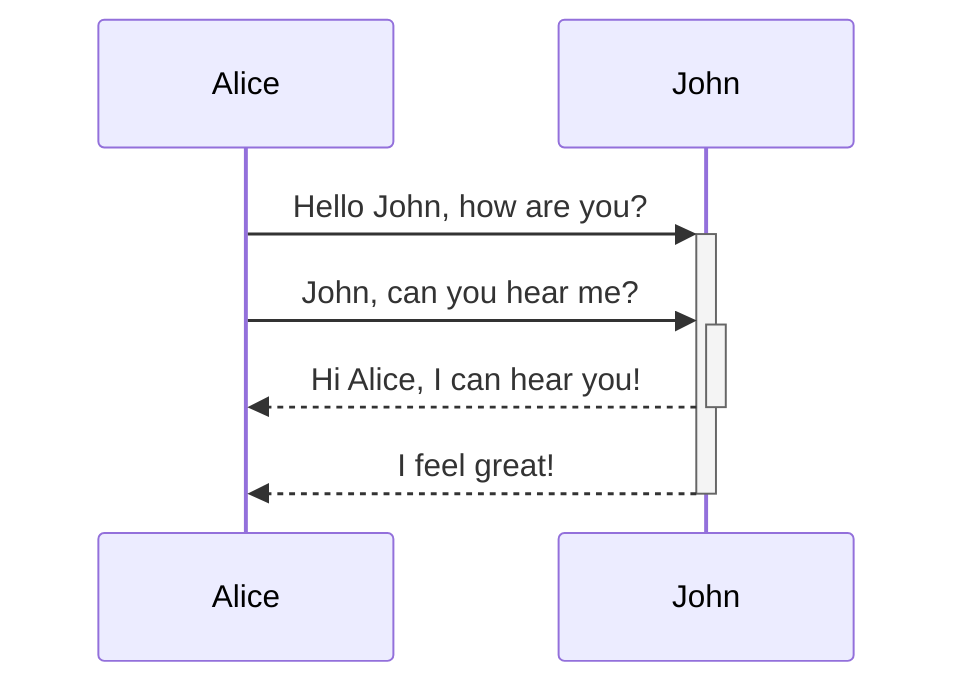

# Some header

```mermaid
sequenceDiagram
    Alice->>+John: Hello John, how are you?
    Alice->>+John: John, can you hear me?
    John-->>-Alice: Hi Alice, I can hear you!
    John-->>-Alice: I feel great!
```

```mermaid
```

```java
class Some {
  public int stuff() {
    return 42;
  }
}
```
