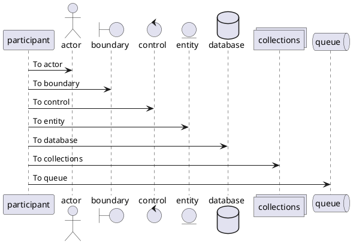

# PlantUML Demo

```plantuml
Bob->Alice : hello
```

```plantuml
Alice -> Bob: Authentication Request
Bob --> Alice: Authentication Response

Alice -> Bob: Another authentication Request
Alice <-- Bob: Another authentication Response
```

```java
class Some {
  public int stuff() {
    return 42;
  }
}
```



