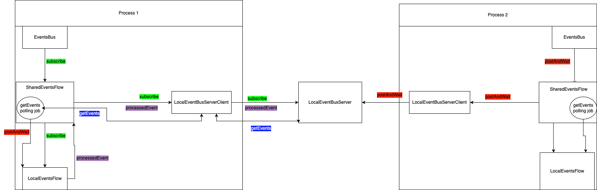

# Events Bus

EventsBus is an event bus implementation that allows components within an application to communicate synchronously through events. It provides a centralized mechanism for publishing and subscribing to events.


## Features

- Events Bus: EventsBus acts as a central hub for events, allowing different parts of your application to communicate without direct dependencies.

- Events: EventsBus supports events that are limited to a single process.

- Shared Events: Events also can be shared across processes, enabling communication between different parts of a distributed system or between separate applications.


## Classes Overview

- EventsBus: Main entry point for using the event bus. Provides methods for posting events, subscribing to events, and managing the server process for shared events.

- Event: class serves as the base class for all events within the event bus framework. It is an open class, allowing for subclassing and customization of event types based on specific application needs.

- SharedEvent: class extends the Event class and implements Serializable, making it suitable for sharing between different processes or components. It inherits the properties and behaviors of the Event class while adding serialization support for inter-process communication.

- LocalEventsFlow: Manages event flow within a single process, handling subscriptions and event processing.

- SharedEventsFlow: Handles shared events between processes, interacting with the server for event transmission.

- LocalEventBusServer: Local server implementation for handling shared events communication.

- LocalEventBusServerClient: Client implementation for communicating with the local server.
## Usage/Examples

# Single process

```kotlin
import com.intellij.tools.ide.starter.bus.EventsBus
import com.intellij.tools.ide.starter.bus.events.Event


fun main() {
    val result = AtomicBoolean(false)
    EventsBus.subscribe("New subscriber") { event: Event -> {
        println(event.toString())
        result.set(true)
        }
    }

    EventsBus.postAndWaitProcessing(Event())

    if (result.get()) println("Event was processed")

    EventsBus.unsubscribeAll()
}
```


# Shared between processes

```kotlin
import com.intellij.tools.ide.starter.bus.EventsBus
import com.intellij.tools.ide.starter.bus.shared.events.SharedEvent


fun main() {
    EventsBus.startServerProcess() // Run local server
    val result = AtomicBoolean(false)
    EventsBus.subscribe("New subscriber") { event: SharedEvent -> {
        println(event.toString())
        result.set(true)
        }
    }

    EventsBus.postAndWaitProcessing(SharedEvent())

    if (result.get()) println("Event was processed")

    EventsBus.endServerProcess() // Stop local server
    EventsBus.unsubscribeAll()
}
```


## Shared scheme


