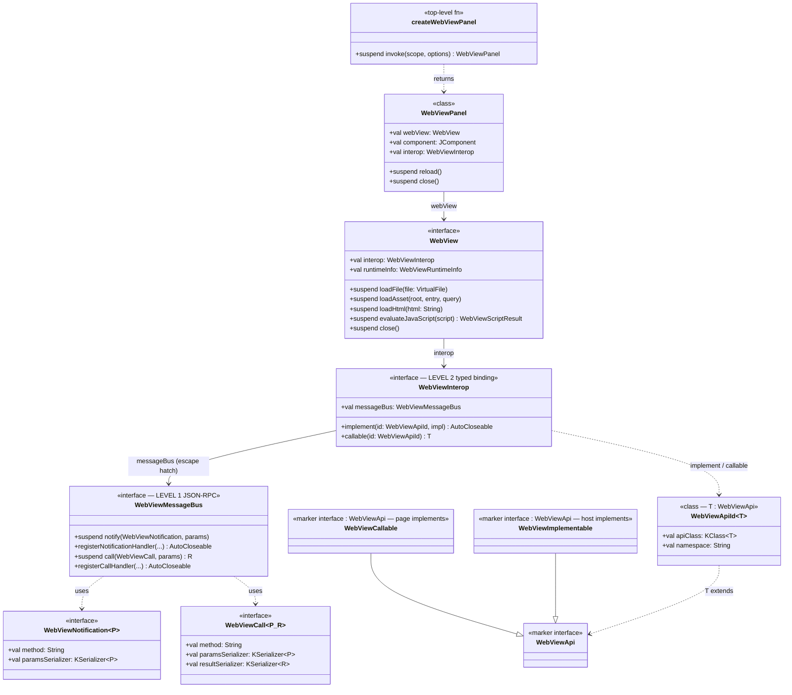
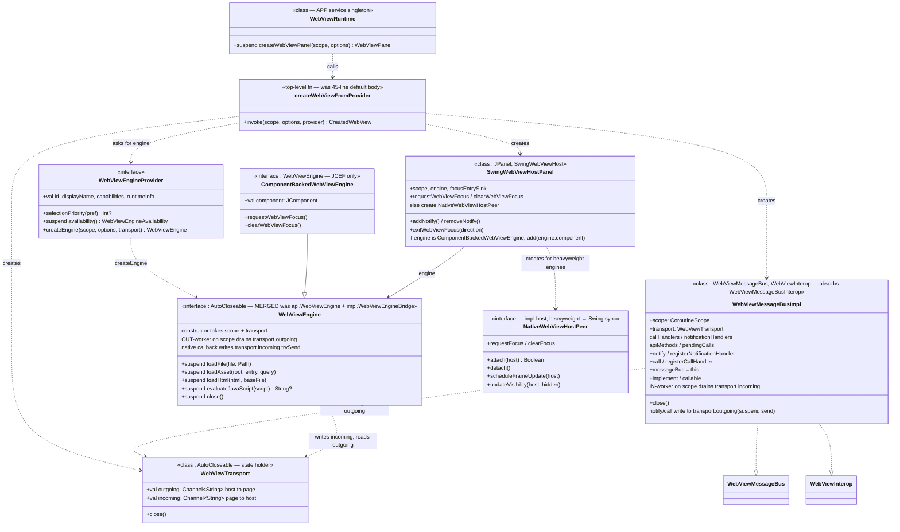
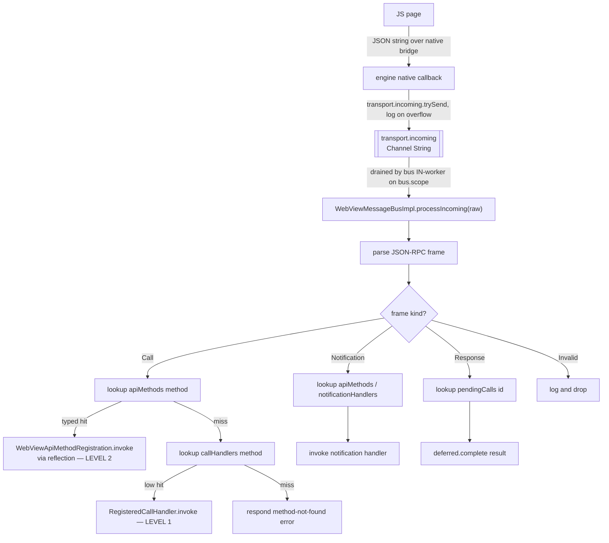
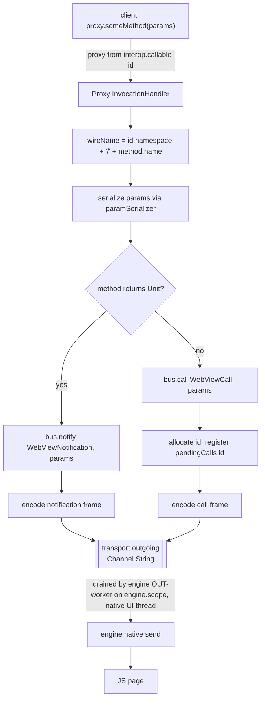
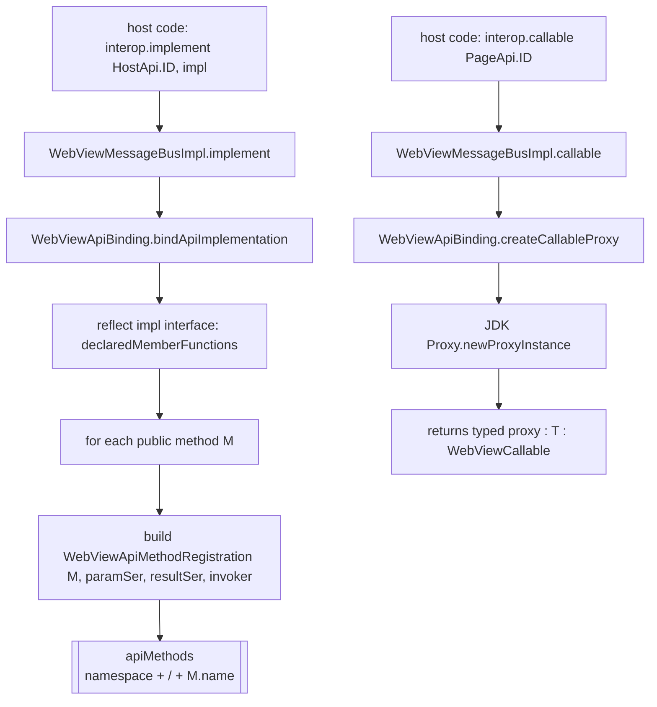

# WebView Architecture Review

Status: review of the current type surface in `community/plugins/ui.webview/`. No code changes were performed; this document records findings and the target shape.

## Scope

The public/internal type surface of the WebView subsystem has accreted overlapping abstractions in the engine layer, the messaging layer, and the WebView-creation entry points. The intended two-layer API split (low-level JSON-RPC bus + typed interface binding on top) is sound, but several types either duplicate one another, exist only to defend a public surface with no production consumers, or have names that overload existing terms with new meanings.

This document lists the findings and sketches the post-cleanup target.

## Findings

| Type / file | Verdict |
|---|---|
| `api.WebViewEngine` | Right name, wrong package. Move to `impl` and merge `WebViewEngineBridge` into it — one internal `WebViewEngine`. |
| `impl.WebViewEngineBridge` | Should not exist. `WebView` doesn't extend `WebViewEngine`; `WebViewEngineFactory` has zero prod callers; every engine implements the bridge anyway. Merge into single internal `WebViewEngine`. |
| `impl.WebViewJsMessageReceiver` | Symptom of asymmetric transport (`suspend transferToJs` vs register-callback `connectMessageBus`). Replace transport with first-class `WebViewTransport` (two `Channel<String>` + `AutoCloseable`) shared by engine and bus. |
| `impl.ComponentBackedWebViewEngine` | Real distinction (JCEF Swing-component vs heavyweight native windows). Keep. |
| `impl.host.NativeWebViewHostPeer` + variants | Real responsibility (heavyweight native window ↔ Swing layout/visibility/focus sync). Keep. Add KDoc. |
| Native `*Bridge` classes (`WKWebViewBridge`, `WinWebView2Bridge`, `LinuxWebKitGtkBridge`) | Native binding layer. Name OK in isolation, but "Bridge" is overloaded — clashes with the engine-layer `Bridge` until that one is renamed away. |
| `WebViewThemeBridge.kt` (file) | No `Bridge` type lives in it — only extension functions. Rename file to `WebViewTheme.kt`. |
| `api.WebViewRuntime` | OK shape, but its public `createWebView` (panel-less) has no prod callers and overlaps with `createWebViewPanel`. Trim. |
| `api.WebViewEngineFactory` | Duplicate of `WebViewRuntime.createEngine`; zero prod consumers. Drop together with public `api.WebViewEngine`. |
| `impl.engine.WebViewEngineProvider` | 45-line default `createWebView` body belongs as a top-level function; `runtimeInfo(engine)` takes an engine arg it never reads; dual `availability` / `availabilityBlocking` should be one. |
| `api.WebViewMessageBus` | Intentional level-1 transport surface, but **incomplete** — only `notify`/`registerNotificationHandler`. Add typed `call`/`registerCallHandler` so both JSON-RPC frame kinds are reachable without level-2 binding. |
| `api.WebViewInterop` | Intentional level-2 typed binding. `messageBus` field is a deliberate level-1 escape hatch, not a leak. |
| `impl.rpc.WebViewMessageBusInterop` | Trivial 3-line adapter with no state. Merge into `WebViewMessageBusImpl` (which implements both `WebViewMessageBus` and `WebViewInterop` directly). |
| `api.WebViewMessageRegistration` | Reinvents `AutoCloseable`. Replace at every return site. |
| `api.WebViewMessageContext` | Single-field `data class(method: String)`. Either grow it or inline the string. |
| `api.WebViewApi` / `WebViewCallable` / `WebViewImplementable` | Three markers for two roles; defensible pattern (mirrors TS side). Add a KDoc note explaining the shape so readers know it's intentional. |
| `api.WebViewNotification<P>` | Interface with two `val`s, lets implementations be `object`s. Borderline; keep. |

### "Bridge" is overloaded three ways in this subsystem

1. Engine + RPC layering — `WebViewEngineBridge`.
2. Native language binding — `WKWebViewBridge`, `WinWebView2Bridge`, `LinuxWebKitGtkBridge`.
3. File label with no corresponding type — `WebViewThemeBridge.kt`.

After the cleanup (1) goes away and (3) is renamed, leaving "Bridge" with one consistent meaning.

## Two-layer API design

The messaging API is intentionally split:

- **Level 1 — low-level JSON-RPC transport** (`WebViewMessageBus`): call/notify/respond primitives over raw JSON strings, no Kotlin interface binding.
- **Level 2 — typed interface binding** (`WebViewInterop`): clients declare a Kotlin interface tagged `WebViewCallable` / `WebViewImplementable`; the runtime proxies/binds it via reflection and serializes through level 1.

`WebViewInterop.messageBus` is a deliberate escape hatch from level 2 back to level 1. Both layers stay public; level 1 needs to be completed so both JSON-RPC frame kinds are reachable from it.

### Completed level-1 shape

```kotlin
interface WebViewMessageBus {
  // notifications (already present)
  suspend fun <P : Any> notify(notification: WebViewNotification<P>, params: P)
  fun <P : Any> registerNotificationHandler(
    notification: WebViewNotification<P>,
    handler: WebViewNotificationHandler<P>,
  ): AutoCloseable

  // calls (request/response) — NEW
  suspend fun <P : Any, R : Any> call(method: WebViewCall<P, R>, params: P): R
  fun <P : Any, R : Any> registerCallHandler(
    method: WebViewCall<P, R>,
    handler: suspend (P, WebViewMessageContext) -> R,
  ): AutoCloseable
}

interface WebViewCall<Params : Any, Result : Any> {
  val method: String
  val paramsSerializer: KSerializer<Params>
  val resultSerializer: KSerializer<Result>
}
```

The dispatcher inside `WebViewMessageBusImpl` already implements call/response routing internally; only the public typed wrapper is missing.

## Target type inventory

### Public API (`com.intellij.ui.webview.api`)

- Entry: `createWebViewPanel(scope, options)`, `WebViewRuntime.createWebViewPanel(scope, options)`
- Panel + view: `WebViewPanel`, `WebViewPanelOptions`, `WebView`, `WebViewScriptResult`, `SwingWebViewHost`
- Engine selection: `WebViewEnginePreference`, `WebViewEngineCapabilities`, `WebViewEngineRequirements`, `WebViewEngineAvailability`, `WebViewEngineId`, `WebViewRuntimeInfo`, `WebViewCreationOptions`
- Assets: `WebViewAssetRoot`, `WebViewAssetPath`, `WebViewAssetProvider`, `WebViewAssetProviderResult`, `WebViewScopedAssetProvider`, `WebViewAssetSource`, `WebViewAssetRootFactory`
- Messaging level 1: `WebViewMessageBus`, `WebViewNotification<P>`, `WebViewCall<P, R>` (new), `WebViewNotificationHandler<P>`, `WebViewRpcException`, `WebViewMessageContext`
- Messaging level 2: `WebViewInterop`, `WebViewApi`, `WebViewCallable`, `WebViewImplementable`, `WebViewApiId<T>`
- Focus: `WebViewFocusDirection`, `WebViewFocusPageApi`, `WebViewFocusHostApi`, `WebViewFocusEntry`, `WebViewFocusExit`

Gone: `WebViewEngine`, `WebViewEngineFactory`, `WebViewEngineKind`, `WebViewMessageRegistration` (replaced by `AutoCloseable` at every return site).

### Internal (`com.intellij.ui.webview.impl` and subpackages)

```
impl/
  WebViewEngine.kt                   merged from api.WebViewEngine + impl.WebViewEngineBridge
  WebViewTransport.kt                NEW — Channel<String> × 2, AutoCloseable
  ComponentBackedWebViewEngine.kt
  SwingWebViewHostPanel.kt
  WebViewLogger.kt, MacMainThreadDispatcher.kt, NativeBridgeLibrary.kt
  WebViewAsset*.kt
  WebViewFocusEntrySink.kt

  engine/
    WebViewEngineProvider.kt         trimmed: no default body, no leaky runtimeInfo(engine)
    WebViewEngineCreationOptions.kt
    DefaultWebViewEngineProviders.kt
    createWebViewFromProvider.kt     NEW — top-level fn extracted from old default body
    WebViewTheme.kt                  renamed from WebViewThemeBridge.kt
    WebViewFocusInterop.kt

  rpc/
    WebViewMessageBusImpl.kt         implements both WebViewMessageBus + WebViewInterop
    WebViewApiBinding.kt
    JsonRpcProtocol.kt

  host/
    NativeWebViewHostPeer.kt         + KDoc
    Mac/Win/Linux variants

  mac/, windows/, linux/, jcef/      concrete engines implementing merged WebViewEngine
```

Gone: `impl.WebViewEngineBridge`, `impl.WebViewJsMessageReceiver`, `impl.rpc.WebViewMessageBusInterop`.

## Public API diagram



## Internal wiring diagram



## Where the channel ↔ typed-API binding lives

Inside `WebViewMessageBusImpl` (with `impl.rpc.WebViewApiBinding.kt` as the reflection helper). The bus owns four dispatch tables:

- `callHandlers` and `notificationHandlers` — populated by level-1 `WebViewMessageBus.register*` calls.
- `apiMethods` — populated by level-2 `WebViewInterop.implement(id, impl)`, which reflects over the `WebViewImplementable` interface and stores per-method serializer + invoker entries keyed by `"namespace/methodName"`.
- `pendingCalls` — outbound calls awaiting their response.

`WebViewInterop.callable(id)` returns a JDK dynamic proxy whose `InvocationHandler` serializes the call args and pushes a frame onto `transport.outgoing`.

### Inbound flow



### Outbound flow



### Registration paths



## Transport overflow and shutdown

Channel capacity is `MAX_QUEUED_FRAMES` (the constant already used by `WebViewMessageBusImpl`). Behaviour:

- **Incoming** (engine → bus): native callback can't suspend, so uses `trySend` + log drop. This matches today's behaviour in `WebViewMessageBusImpl.transferFromJs`. Note that dropping a response frame still hangs the caller — an existing correctness gap, not a regression.
- **Outgoing** (bus → engine): `notify` and `call` are suspend, so they use `send` with back-pressure. A slow engine stalls RPC callers; capacity is sized to keep this rare.

Shutdown order is owner-driven: bus closes first (stops incoming dispatch and outgoing production), engine closes next (stops native I/O), transport last (closes both channels). Both workers see channel closure as a normal loop exit.

## Recommendations (ROI-ranked)

Pure cleanup, no public-API break:

1. Delete `WebViewJsMessageReceiver`; the engine takes a `WebViewTransport` at construction instead.
2. Rename file `WebViewThemeBridge.kt` → `WebViewTheme.kt` (no type by that name lives in it).
3. Add KDoc to `NativeWebViewHostPeer` explaining its responsibility.
4. Merge `WebViewMessageBusInterop` into `WebViewMessageBusImpl` (impl implements `WebViewMessageBus` + `WebViewInterop` directly).
5. Extract `WebViewEngineProvider.createWebView` 45-line default body into a top-level `createWebViewFromProvider` function.
6. Make `WebViewEngineProvider.runtimeInfo` a `val`, not a function taking the engine.
7. Reduce `WebViewEngineProvider.availability` to one method (drop the blocking overload).

Public-API changes (everything is `@ApiStatus.Experimental`, so allowed):

8. Replace `WebViewMessageRegistration` with `AutoCloseable` at every return site.
9. Complete level-1 transport: add typed `call(...)` and `registerCallHandler(...)` to `WebViewMessageBus` plus a `WebViewCall<P, R>` descriptor mirroring `WebViewNotification<P>`.
10. Drop `api.WebViewEngineFactory` and `WebViewRuntime.createEngine`; tests go through `createWebViewPanel` / `WebViewRuntime.createWebViewPanel` or an internal test helper.
11. Drop `api.WebViewEngine` and merge `impl.WebViewEngineBridge` into a single internal `WebViewEngine`. This is the central win — name preserved, layering noise gone.
12. Extract a first-class `WebViewTransport` (`AutoCloseable`, two `Channel<String>`) shared by engine and bus; removes the asymmetric `transferToJs`/`connectMessageBus` pair and the two-step wiring.
13. Decide whether `WebViewMessageContext` will grow fields; if not, inline the method name into handler signatures.

## Recommendations status

Legend: ✅ done · ⏳ partial · ⬜ todo · 🚫 blocked · 🗑️ dropped. Re-check at each cleanup commit.

| # | Item | Status | P |
|---|---|---|---|
| 1 | Delete `WebViewJsMessageReceiver`; engine takes `WebViewTransport` at construction | ⬜ | P1 |
| 2 | Rename file `WebViewThemeBridge.kt` → `WebViewTheme.kt` | ⬜ | P1 |
| 3 | Add KDoc to `NativeWebViewHostPeer` | ⬜ | P1 |
| 4 | Merge `WebViewMessageBusInterop` into `WebViewMessageBusImpl` | ⬜ | P1 |
| 5 | Extract `WebViewEngineProvider.createWebView` default body into top-level `createWebViewFromProvider` | ⬜ | P1 |
| 6 | `WebViewEngineProvider.runtimeInfo` → `val` | ⬜ | P1 |
| 7 | Reduce `WebViewEngineProvider.availability` to one method | ⬜ | P1 |
| 8 | Replace `WebViewMessageRegistration` with `AutoCloseable` at every return site | ⬜ | P1 |
| 9 | Complete level-1 transport: typed `call` / `registerCallHandler` + `WebViewCall<P, R>` | ⬜ | **P0** |
| 10 | Drop `api.WebViewEngineFactory` and `WebViewRuntime.createEngine` | ⬜ | P1 |
| 11 | Drop `api.WebViewEngine`; merge `impl.WebViewEngineBridge` into single internal `WebViewEngine` | ⬜ | P1 |
| 12 | Extract first-class `WebViewTransport` (two `Channel<String>` + `AutoCloseable`) | ⬜ | P1 |
| 13 | Decide on `WebViewMessageContext` fields — grow or inline method name | ⬜ | P2 |

Item #9 is blocking: plugin authors cannot use the public API for typed request/response RPC, only notifications. The internal dispatcher already handles call/response — see `Inbound flow` diagram above — so completing the public surface is mostly type-level work.
