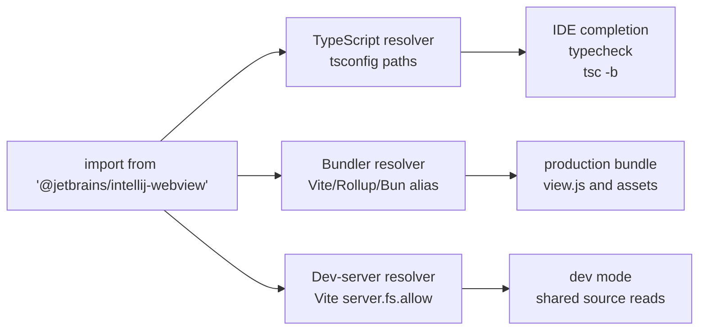
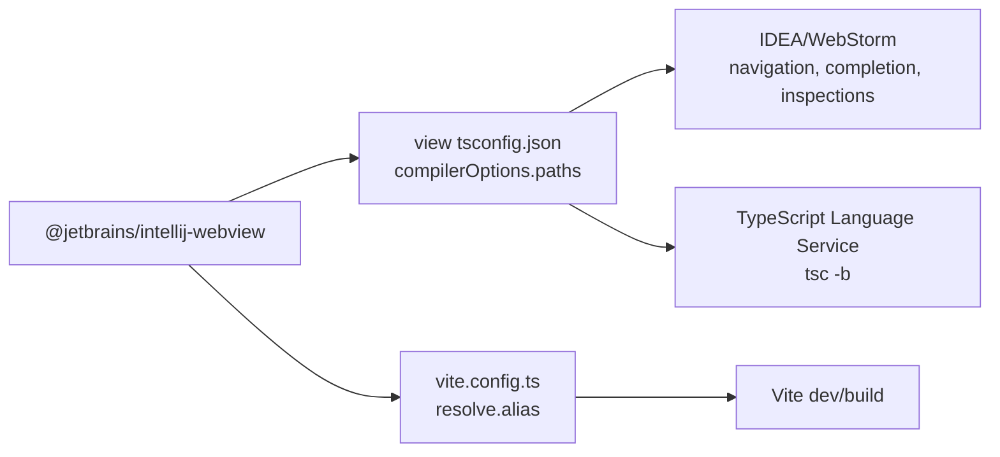
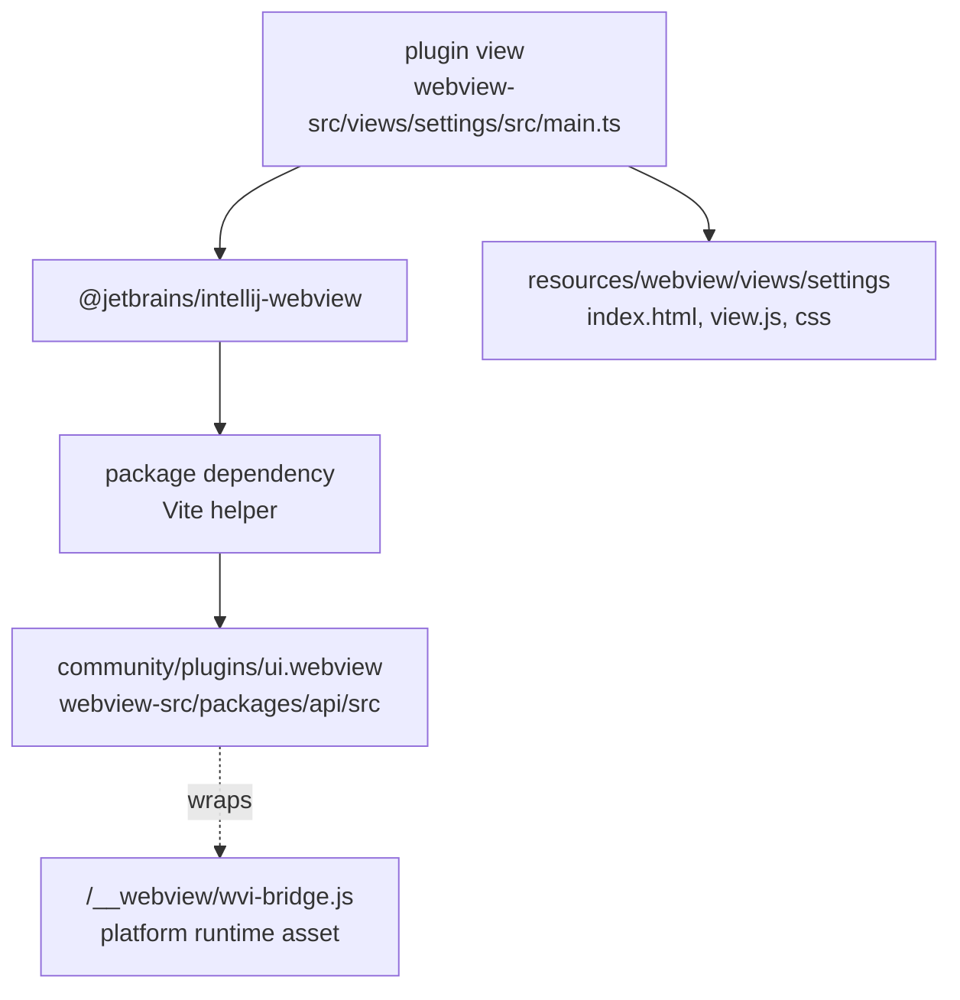
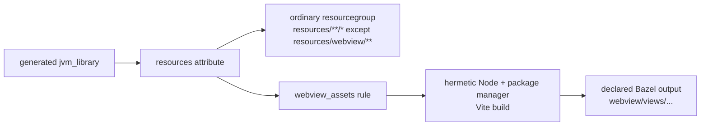
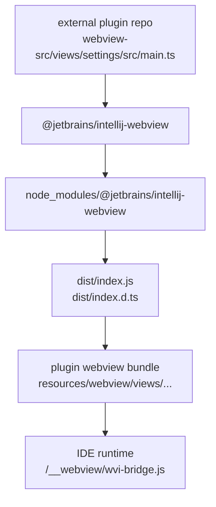
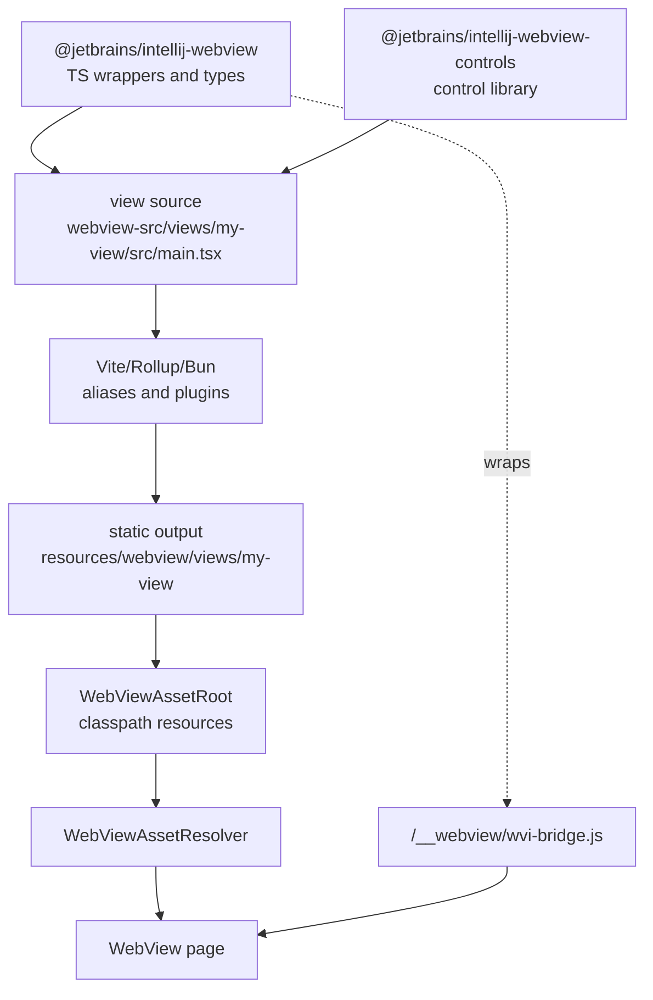
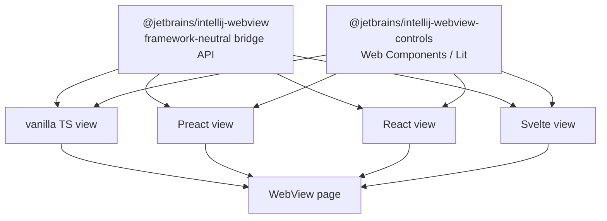
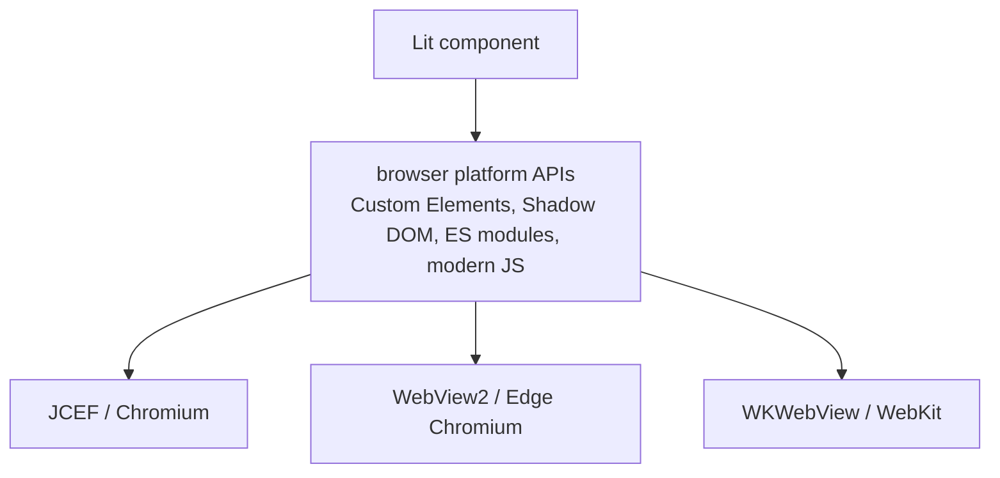

# WebView Frontend Build Strategy

Status: ⏳ **PARTIAL**. Vite helper (`defineWebViewViewConfig` / `defineWebViewViewConfigs`) and monorepo `@jetbrains/intellij-webview` aliasing ship in `webview-src/`. Full Bazel graph integration and the published `@jetbrains/intellij-webview` SDK pipeline are deferred — current repository integration is manual / semi-manual.

| Item | Status |
|---|---|
| Vite helper for view config + dev/production HTML transforms | ✅ |
| Monorepo `@jetbrains/intellij-webview` packages under `webview-src/packages/` | ✅ |
| Manual `bun run build` / `vite build` per module | ✅ |
| Bazel `webview_assets` rule integrating into the main graph | ⬜ deferred |
| SDK publication path (versioned npm or tarball-in-jar) | ⬜ see [SDK Distribution](WebView-Frontend-SDK-Distribution.md) |

Detailed companion notes:

- [Frontend Dependency Resolution](WebView-Frontend-Dependency-Resolution.md) - resolver policy, monorepo aliases, package-manager mode, and why arbitrary jar/zip imports are not a supported frontend contract.
- [Frontend Framework Policy](WebView-Frontend-Framework-Policy.md) - Custom Elements, Lit, Preact/React/Svelte tradeoffs, Ring UI caveat, and browser/WebView engine requirements.
- [Frontend View Model Patterns](WebView-Frontend-View-Model-Patterns.md) - Kotlin/WebView state boundary, bridge DTOs, frontend stores, projections, and scenario cookbook.
- [Frontend SDK Distribution](WebView-Frontend-SDK-Distribution.md) - how plugin authors get TypeScript APIs that match their selected IntelliJ Platform SDK version.
- [Frontend Testability Without IDE](WebView-Frontend-Testability.md) - running views in a real browser with a test bridge, simple Java mock backend, and Playwright/Selenium automation.

## Goal

WebView UI sources should be ordinary frontend source code, not hand-written files under Java `resources` roots. A view should be able to import shared WebView runtime helpers, control libraries, and feature APIs with stable package-style imports, then produce static assets that the existing `WebViewAssetRoot` and `WebViewAssetResolver` can serve.

The target source/output shape is:

```text
some/java/module/
  webview-src/
    views/
      settings/
      index.html
      src/main.tsx
    package.json
    tsconfig.json
    vite.config.ts
  resources/
    webview/
      views/
        settings/
          index.html
          view.js
          styles.css
          assets/
            react.js
            mermaid.js
            KaTeX_Main-Regular.woff2
```

The generated `resources/webview/views/...` files are the browser artifact. The source of truth for the UI is `webview-src/views/...`. A Java module may contain multiple independent views under `webview-src/views/<view-id>`; every view maps to `resources/webview/views/<view-id>`. The Vite helper writes stable file names: the entry bundle is `view.js`, CSS is `styles.css`, and additional JavaScript chunks, fonts, images, or other assets go under `assets/` without content-hash suffixes.

## Recommended Toolchain

Use Vite as the default view/application bundler:

- it handles TypeScript, JSX/TSX, CSS, assets, framework plugins, and static build output;
- it supports `resolve.alias` for source packages in the monorepo;
- it supports `server.fs.allow` for development when shared source lives outside the view root;
- it can emit static assets into the target `resources/webview/views/...` directory.

Use `tsc -b` for shared frontend packages when they need declaration output or independent typechecking. Bun or esbuild remain acceptable for small tactical bundles, but they should use the same package-style import policy.

## Current View Build Pipeline

The current repository integration is explicit and commit-oriented. There is no automatic TypeScript-to-Bazel resource graph for WebView views yet, so generated files under `resources/webview/` are produced by the frontend build and committed to the repository.

For each module-level `webview-src/build.ts`, the build script calls `defineWebViewViewConfigs({ webviewSrcDir, views })` and then runs `vite.build(...)` once per view. Each view gets an independent Vite config:

- `root` is `webview-src/views/<view-id>`;
- `outDir` is `../resources/webview/views/<view-id>`;
- `emptyOutDir` is enabled, so stale generated files from an older layout are removed on rebuild;
- `base` is `./`, so generated HTML uses relative links that work when served from `WebViewAssetResolver`;
- the common WebView runtime scripts are injected into `index.html` by the helper, not written by each view.

The generated view layout is intentionally stable:

```text
resources/webview/views/<view-id>/
  index.html
  view.js
  styles.css
  assets/
    react.js
    react-dom.js
    mermaid.js
    <package-name>.js
    <font-or-image-asset>
```

`view.js` contains the local entry code for the view. JavaScript dependencies from `node_modules` are split by npm package name through the Vite output chunk hook, so imports from `react` produce `assets/react.js`, imports from `@scope/package` produce `assets/scope-package.js`, and Mermaid/D3/KaTeX dependencies use their package names. This keeps code splitting without Vite content hashes and without one monolithic `vendor.js`.

CSS code splitting is disabled for view builds. CSS remains a separate browser asset, but it is emitted as one predictable `styles.css` file instead of package-specific CSS chunks. Non-CSS assets such as KaTeX fonts are emitted under `assets/` with their original stable names.

The manual build commands are:

```shell
cd community/plugins/ui.webview/webview-src && bun run build
cd community/plugins/ui.webview/demo/webview-src && bun run build
cd community/plugins/ui.webview/markdown-preview/webview-src && bun run build
```

Module-level view builds also accept view ids after `--` for local targeted rebuilds, and `--watch` for Vite watch mode:

```shell
cd community/plugins/ui.webview/demo/webview-src && bun run build -- sample-panel
cd community/plugins/ui.webview/demo/webview-src && bun run build -- --watch sample-panel
```

The repository also has manual Bazel targets that run the same asset builds:

```shell
./bazel.cmd run @community//plugins/ui.webview:build_web_assets
./bazel.cmd run @community//plugins/ui.webview/demo:build_web_assets
./bazel.cmd run @community//plugins/ui.webview/markdown-preview:build_web_assets
```

After running the frontend build, commit the generated `resources/webview/` output together with the source changes. Do not hand-edit generated `resources/webview/views/<view-id>/index.html`, `view.js`, `styles.css`, or `assets/*`; change the corresponding `webview-src/views/<view-id>` source and rebuild.

## Resolver Policy

There are three resolvers, and all of them must agree on the same imports:



`tsconfig` alone is not enough. `compilerOptions.paths` lets TypeScript and the IDE understand an import, but it does not make the production bundle resolve that import. The bundler config must mirror the same mapping.

Use package-style imports everywhere:

```ts
import { webView } from "@jetbrains/intellij-webview"
import { Button, Toolbar } from "@jetbrains/intellij-webview-controls"
```

Do not import shared code through Java-module-relative paths:

```ts
import { webView } from "../../../../community/plugins/ui.webview/webview-src/packages/api/src"
```

Relative imports across Java module directories bake checkout layout into frontend code and do not translate to external plugin repositories.

## IDE Resolution Support

IntelliJ IDEA and WebStorm can resolve the proposed imports when the IDE can see the same resolver contract as TypeScript and the bundler.



For `.ts` and `.tsx` files, `tsconfig.json` is the primary IDE contract. The view sources must be included by the relevant `tsconfig.json`, and shared package imports must resolve through the same package-manager dependency or path mapping that the bundler sees.

When package-manager dependencies are not available, `compilerOptions.paths` can still map package names to source. Prefer declaring both the bare package import and subpath imports when both forms are expected:

```json
{
  "compilerOptions": {
    "paths": {
      "@jetbrains/intellij-webview": [
        "../../../../community/plugins/ui.webview/webview-src/packages/api/src"
      ],
      "@jetbrains/intellij-webview/*": [
        "../../../../community/plugins/ui.webview/webview-src/packages/api/src/*"
      ]
    }
  }
}
```

Do not rely on Vite-only aliases for TypeScript code. Vite can bundle such imports, and WebStorm can recognize Vite aliases, but TypeScript correctness, declaration generation, and stable IDE analysis should come from package-manager resolution or `tsconfig.json` path mappings.

For Vite-based views, keep `vite.config.ts` under the view root or another location that WebStorm can auto-detect, use a standard config name, and define aliases as absolute paths. WebStorm documents Vite alias recognition and module-resolution auto-detection for `vite.config.js`, `vite.config.ts`, `vite.config.mjs`, and `vite.config.cjs`.

The practical IDE rules are:

- shared source packages must be inside the opened checkout, and the relevant directories must not be excluded from the project;
- each module-level `webview-src/tsconfig.json` should include its `views/**/*.ts` and `views/**/*.tsx` files;
- each Vite config should use the shared WebView helper instead of repeating source/output paths;
- JavaScript-only views should use `jsconfig.json` path mappings or bundler aliases, because `tsconfig.json` path mappings are a TypeScript contract;
- external plugin repositories should resolve the same imports from `node_modules` packages with `dist/index.d.ts`, so no monorepo alias is needed there;
- after changing resolver config, restarting the TypeScript Language Service may be needed before IDE diagnostics catch up.

## Monorepo Source Mode

Inside the IntelliJ monorepo, the same package import should resolve to shared source:



Example `package.json` for a monorepo module view package:

```json
{
  "private": true,
  "type": "module",
  "scripts": {
    "build": "bun run build.ts",
    "typecheck": "tsc -p tsconfig.json --noEmit"
  },
  "dependencies": {
    "@jetbrains/intellij-webview": "file:<relative-path-to-community/plugins/ui.webview/webview-src>"
  },
  "devDependencies": {
    "typescript": "^5.6.0",
    "vite": "^6.0.0"
  }
}
```

The relative `file:` dependency is package-manager configuration, not application source. The TypeScript sources and Vite configs still import stable package names.

Example `tsconfig.json` for a module with views:

```json
{
  "extends": "@jetbrains/intellij-webview/tsconfig.view.json",
  "compilerOptions": {
    "types": ["node"]
  },
  "include": ["build.ts", "vite.config.ts", "views/**/*.ts", "views/**/*.tsx"]
}
```

Example `build.ts` for a module with one or more views:

```ts
import { dirname } from "node:path"
import { fileURLToPath } from "node:url"
import { build } from "vite"
import { defineWebViewViewConfigs, selectWebViewViewBuildEntries, withWebViewBuildWatch } from "@jetbrains/intellij-webview/vite"

const webviewSrcDir = dirname(fileURLToPath(import.meta.url))
const selectedViews = selectWebViewViewBuildEntries(["settings", "inspector"])

for (const config of defineWebViewViewConfigs({ webviewSrcDir, views: selectedViews.views })) {
  await build(withWebViewBuildWatch(config, selectedViews.watch))
}
```

The helper owns the default layout: `webview-src/views/<view-id>` -> `resources/webview/views/<view-id>`. A view can override `sourceDir` or `outDir`, but that should be exceptional.

## Bazel Integration Modes

The current integration mode is manual/semi-manual. Each module with frontend sources can expose a local Bazel trigger target named `build_web_assets`, backed by the shared `community/plugins/ui.webview/build-web-assets` script. Running this target executes the module package-manager build and materializes static output under the module-local `resources/webview/...` tree:

```text
bazel run <module-label>:build_web_assets
```

This target is intentionally not a dependency of the generated `jvm_library` target yet. In the current mode, Java resource packaging consumes whatever files already exist under `resources/`; developers or CI steps that need fresh frontend assets must run the frontend build before the Java packaging step. This avoids making every ordinary JVM Bazel build require Node, pnpm/npm/bun, or installed `node_modules` before the monorepo has an agreed hermetic frontend toolchain.

The desired future mode is a real Bazel graph edge:



That graph should be implemented only after the repository has a supported Node toolchain and package-manager story. The `webview_assets` rule should produce declared Bazel outputs, not write side effects into the source tree, and should provide `ResourceGroupInfo` so the generated `jvm_library.resources` entry can package the assets into the module jar.

The generated `BUILD.bazel` section should keep being generated by `jpsModelToBazel`; this should not use `### skip generation section` for the whole module. Instead, the generator should add a WebView resource target for modules that opt into the `webview-src` layout, and then add that target to the generated `resources` list. Any helper targets outside the generated section may stay as preserved manual code, but the dependency from `jvm_library` to WebView assets must be emitted by the generator so regeneration remains stable.

Until that toolchain work is done, do not wire frontend builds into generated `jvm_library` targets. Doing so would make unrelated JVM builds fail on machines that do not have the selected runtime/package manager installed.

## Published Plugin Mode

External plugin repositories should keep the same imports, but resolve them through package manager dependencies:



This gives one source-level contract:

- inside the monorepo, package dependencies can point to `community/plugins/ui.webview/webview-src`, whose exports point to shared source;
- outside the monorepo, `node_modules` points to published packages;
- the application code does not change.

Published packages should contain at least:

```text
dist/index.js
dist/index.d.ts
package.json
```

The package version should describe frontend API compatibility with the IDE WebView runtime version. A view built against a newer frontend package should be able to fail clearly if the loaded IDE runtime is too old.

## Runtime Bridge Boundary

The platform bridge stays a runtime asset served from the common WebView path:

```html
<script src="/__webview/wvi-bridge.js"></script>
```

Frontend packages should not bundle another copy of `wvi-bridge.js`. They should type and wrap the existing `window.__WVI__` global:

```ts
import { apiId, webView, type WebViewCallable } from "@jetbrains/intellij-webview"

interface SettingsHostApi extends WebViewCallable {
  openConfig(params: { path: string }): Promise<void>
}

const settingsHostApiId = apiId<SettingsHostApi>()("settings.host")

await webView.notification(SettingsNotifications.ready).send({})
const host = webView.callable(settingsHostApiId)
await host.openConfig({ path: "inspectionProfile" })
```

The final runtime relationship is:



## Framework Policy

The base runtime package must stay framework-neutral. A plugin-facing WebView API should not require React, Vue, Svelte, or another application framework just to call the host bridge.

The recommended split is:

```text
@jetbrains/intellij-webview             framework-neutral runtime wrappers and types
@jetbrains/intellij-webview-controls    shared controls as Web Components, implemented with Lit or plain custom elements
@jetbrains/intellij-webview-preact      optional Preact helpers for JSX-based views
@jetbrains/intellij-webview-react       optional React helpers only when React-specific integration is needed
```

Shared controls should be published as custom elements where practical. Lit is a good implementation choice for that layer because it is small, TypeScript-friendly, and produces standard Web Components that can be used from React, Preact, Svelte, Vue, vanilla TypeScript, or no framework at all.



Framework recommendation for view authoring:

| Choice | Use when | Avoid as default when |
| --- | --- | --- |
| Lit / Web Components | publishing shared controls, small and medium IDE panels, framework-neutral plugin APIs | the view is a large app where the team strongly wants JSX/hooks ergonomics |
| Preact | a sample or product view wants React-like JSX with a much smaller runtime and DOM-native events | the view depends on React libraries that are not proven with `preact/compat` |
| React | the view explicitly needs React-only ecosystem code, for example a proven dependency on Ring UI or another React control library | the view is a small IDE panel, or the dependency would force every plugin-facing control API to become React-specific |
| Svelte | a team owns the whole view and wants compiler-driven components with strong WebStorm support | publishing shared controls for arbitrary plugin authors, unless compiled as custom elements and tested that way |
| Vue / Solid | a plugin team already owns that stack and bundles it locally | platform-level defaults, because they add another framework contract without solving the shared-control neutrality problem |

Full React is not the best platform default for WebView pages. It has the strongest ecosystem and excellent IDE support, but it also makes shared control APIs React-specific and increases the baseline runtime for small IDE panels. If current samples use React-style code, Preact is the more reasonable JSX default unless a React-only library is required.

Ring UI deserves separate validation. It is JetBrains-owned and explicitly targets JetBrains web products and third-party plugins, but it is React-based and has its own web-product visual language and build assumptions. It can be a good choice for a complex React view, but should not become the mandatory platform control layer without a prototype that verifies bundle size, theme integration, focus behavior, keyboard navigation, and visual fit inside IDE WebViews.

Lit is not a browser feature by itself; it is a JavaScript library that uses modern browser platform APIs. The browser must support Custom Elements, Shadow DOM, `<template>`, ES modules, and modern JavaScript. That matches modern WebView engines such as JCEF/Chromium, WebView2/Edge Chromium, and WKWebView/WebKit, but it does not include legacy browsers such as Internet Explorer 11 or Classic Edge.



For this WebView layer, the intended policy is to target modern IDE WebView engines with Lit 3 and no legacy-browser polyfills. If a future embedding target uses an older browser engine, it must be validated separately before adopting Lit-based controls there.

Each view bundle should normally include the controls it uses. Shared runtime assets should stay limited to platform-owned bridge/runtime files that must be exactly matched to the host runtime.

## Verification

For JS/TS-only changes, the relevant checks are:

- `tsc -b` for shared packages that emit declarations;
- `vite build` or the selected bundler build for each view;
- a small fixture that imports shared source from another directory and proves that TypeScript, production bundling, and dev serving all resolve the same package import;
- browser-harness tests for substantial UI behavior, using a real browser plus the test bridge and mock Java backend described in [Frontend Testability Without IDE](WebView-Frontend-Testability.md);
- WebView smoke loading of the generated static `index.html` through `WebViewAssetRoot`.

Do not use Java build success as proof that frontend resolution is correct. Java packaging only sees the generated static files.

## References

- TypeScript `paths`: https://www.typescriptlang.org/tsconfig/paths.html
- TypeScript `rootDirs`: https://www.typescriptlang.org/tsconfig/rootDirs.html
- TypeScript project references: https://www.typescriptlang.org/docs/handbook/project-references.html
- IntelliJ IDEA TypeScript support: https://www.jetbrains.com/help/idea/typescript-support.html
- WebStorm TypeScript import path mappings: https://www.jetbrains.com/help/webstorm/settings-code-style-typescript.html
- WebStorm Vite alias resolution: https://www.jetbrains.com/help/webstorm/vite.html
- WebStorm webpack alias resolution: https://www.jetbrains.com/help/webstorm/using-webpack.html
- WebStorm React support: https://www.jetbrains.com/help/webstorm/react.html
- WebStorm Svelte support: https://www.jetbrains.com/help/webstorm/svelte.html
- React installation and app creation: https://react.dev/learn/installation
- Preact homepage and guide: https://preactjs.com/
- Preact React compatibility: https://preactjs.com/guide/v11/switching-to-preact/
- Lit documentation: https://lit.dev/docs/v3/
- Lit browser and tooling requirements: https://lit.dev/docs/tools/requirements/
- Svelte homepage: https://svelte.dev/
- JetBrains Ring UI: https://github.com/JetBrains/ring-ui
- Vite shared options: https://vite.dev/config/shared-options
- Vite server filesystem options: https://vite.dev/config/server-options
- Vite build options: https://vite.dev/config/build-options
- Rollup plugin development: https://rollupjs.org/plugin-development/
- esbuild plugins: https://esbuild.github.io/plugins/
- Bun bundler: https://bun.sh/docs/bundler
- Bun plugins: https://bun.sh/docs/bundler/plugins
