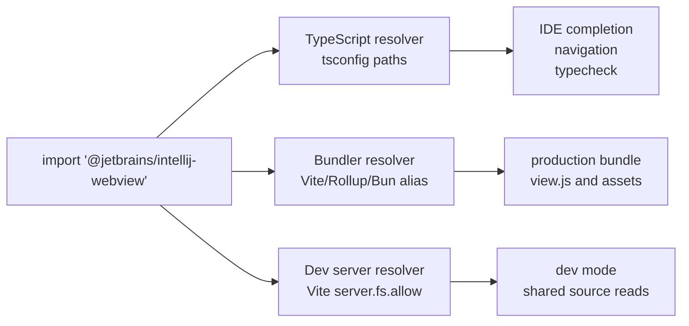
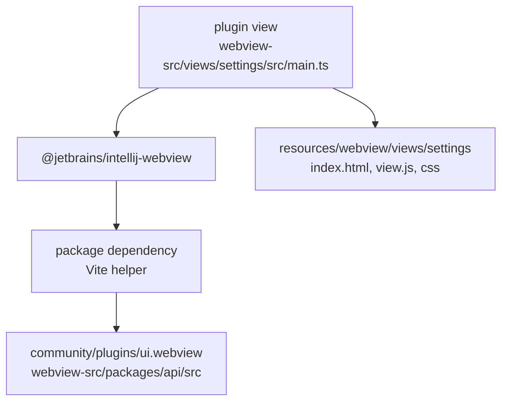
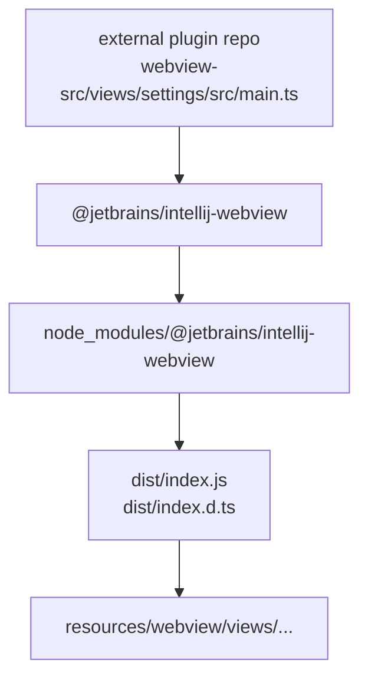
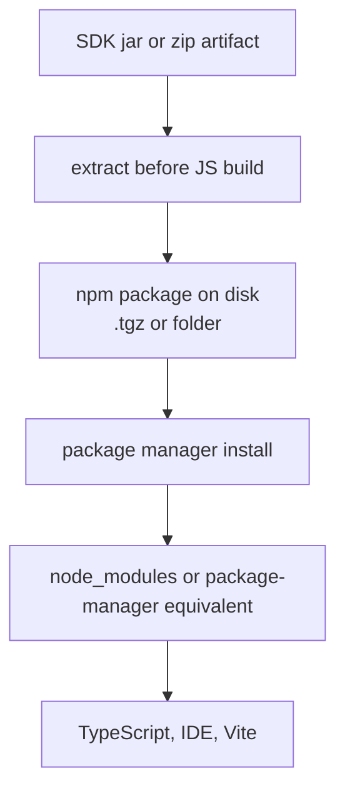
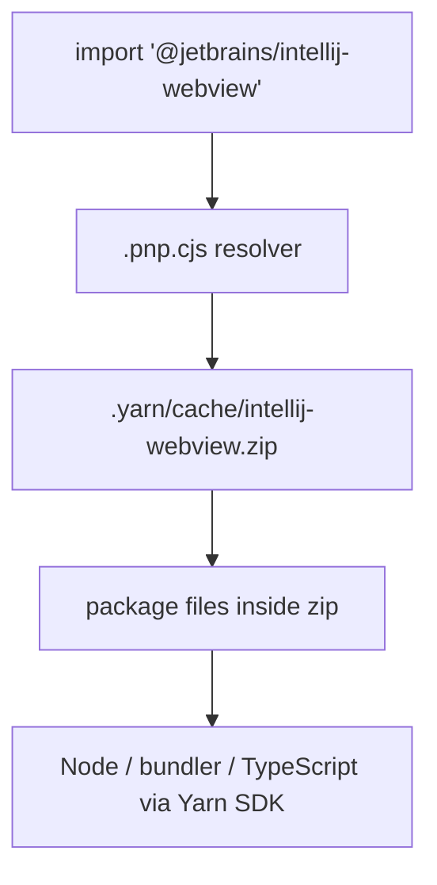

# WebView Frontend Dependency Resolution

Status: design note for resolving JavaScript and TypeScript dependencies used by WebView UI sources. This document is written for a Java-first repository where frontend code is bundled into Java resources before packaging.

## Basic Model

Frontend code imports dependencies by module name:

```ts
import { webView } from "@jetbrains/intellij-webview"
import { Button } from "@jetbrains/intellij-webview-controls"
```

A resolver decides where those names point. In normal frontend projects that answer usually comes from `node_modules`, `package.json`, and `tsconfig.json`. In this repository we also need source aliases because shared TypeScript sources can live in Java module directories.

The source code should still use package-style imports. It should not contain checkout-relative paths to another Java module.

```ts
// Good: stable package contract.
import { webView } from "@jetbrains/intellij-webview"

// Bad: binds source code to the current monorepo layout.
import { webView } from "../../../../community/plugins/ui.webview/webview-src/packages/api/src"
```

## Three Resolvers

The same import is interpreted by several tools. All of them must agree.



`tsconfig.json` is the primary contract for TypeScript and IDE analysis. It lets TypeScript and IntelliJ IDEA/WebStorm understand where types and source files live. It does not make a production bundle resolve the same import, so the bundler config must mirror the same mapping.

## Monorepo Source Mode

Inside the IntelliJ monorepo, package imports resolve to real source files.



Example `package.json` + `tsconfig.json`:

```json
{
  "dependencies": {
    "@jetbrains/intellij-webview": "file:<relative-path-to-community/plugins/ui.webview/webview-src>"
  },
  "devDependencies": {
    "typescript": "^5.6.0",
    "vite": "^6.0.0"
  }
}
```

```json
{
  "extends": "@jetbrains/intellij-webview/tsconfig.view.json",
  "compilerOptions": {
    "types": ["node"]
  },
  "include": ["build.ts", "vite.config.ts", "views/**/*.ts", "views/**/*.tsx"]
}
```

Example `build.ts`:

```ts
import { dirname } from "node:path"
import { fileURLToPath } from "node:url"
import { build } from "vite"
import { defineWebViewViewConfigs } from "@jetbrains/intellij-webview/vite"

const webviewSrcDir = dirname(fileURLToPath(import.meta.url))

for (const config of defineWebViewViewConfigs({ webviewSrcDir, views: ["settings"] })) {
  await build(config)
}
```

## Published Package Mode

External plugin repositories should use the same imports, but resolve them from normal package-manager dependencies.



The package should provide at least:

```text
package.json
dist/index.js
dist/index.d.ts
```

Example package metadata:

```json
{
  "name": "@jetbrains/intellij-webview",
  "version": "252.12345.10",
  "type": "module",
  "exports": {
    ".": {
      "types": "./dist/index.d.ts",
      "import": "./dist/index.js"
    }
  },
  "sideEffects": false
}
```

## Zip and Jar Inputs

Resolving directly from arbitrary zip or jar paths is not a good platform contract.

```text
platform-ui-webview.jar!/webview-sdk/npm
webview-api.zip!/api/src
```

The reason is not that it is impossible. It is that every frontend tool would need to understand the same virtual filesystem: TypeScript Language Service, IntelliJ IDEA/WebStorm navigation, Vite/Rollup/esbuild, test runners, source maps, auto-import, and refactoring.

TypeScript can be customized through the Compiler API by implementing a custom `CompilerHost.resolveModuleNames` and custom file reads, and bundlers can read virtual modules through plugins. That can make one build work, but it does not give a normal plugin author a standard toolchain.

The preferred rule is:



Jar or zip can be a transport format. It should not be the import-resolution format seen by TypeScript source code.

## Yarn Plug'n'Play

Yarn Plug'n'Play is the main real-world exception: it can store packages in zip archives and use a generated `.pnp.cjs` loader to resolve dependencies. That works because Yarn owns the package-manager contract and provides tooling around it.



Yarn PnP can be supported as a package-manager mode, but it should not be confused with a custom IntelliJ jar resolver for TypeScript imports.

## Policy

- Source code uses package-style imports.
- In the monorepo, `tsconfig paths` and bundler aliases point to real source files.
- In external plugin repositories, imports resolve to npm packages.
- Jar or zip artifacts may deliver packages, but must be extracted or installed into a package-manager-visible location before JS/TS build.
- Direct `jar!` or `zip!` imports are not part of the supported frontend contract.

## References

- TypeScript module resolution theory: https://www.typescriptlang.org/docs/handbook/modules/theory.html
- TypeScript `moduleResolution`: https://www.typescriptlang.org/tsconfig/moduleResolution.html
- TypeScript Compiler API: https://github.com/microsoft/TypeScript/wiki/Using-the-Compiler-API
- Vite plugin API: https://vite.dev/guide/api-plugin/
- esbuild plugins: https://esbuild.github.io/plugins/
- Yarn Plug'n'Play: https://yarnpkg.com/features/pnp
- Yarn PnP specification: https://yarnpkg.com/advanced/pnp-spec
- Yarn editor SDKs: https://yarnpkg.com/getting-started/editor-sdks
