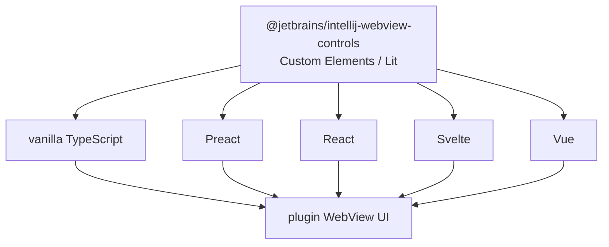
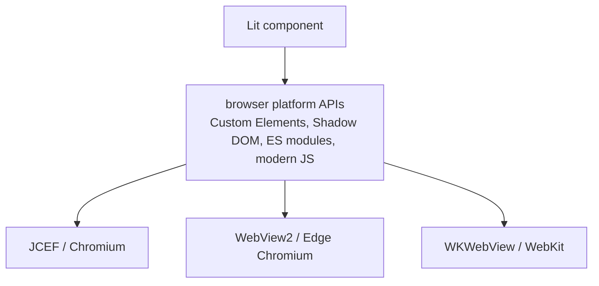

# WebView Frontend Framework Policy

Status: design note for choosing a UI framework and publishing reusable controls for WebView-based plugin UIs.

## Baseline Concepts

A WebView page is a browser page embedded into the IDE. It can be written with plain HTML, CSS, and TypeScript, or with a UI framework such as React, Preact, Svelte, Vue, or Lit.

The platform-level API should not force one application framework on every plugin author. The stable layer should be framework-neutral, and optional framework adapters can be added on top.

## Recommended Package Split

```text
@jetbrains/intellij-webview             framework-neutral runtime wrappers and types
@jetbrains/intellij-webview-controls    shared controls as Web Components, implemented with Lit or plain custom elements
@jetbrains/intellij-webview-preact      optional Preact helpers for JSX-based views
@jetbrains/intellij-webview-react       optional React helpers only when React-specific integration is needed
```

The runtime package wraps the WebView bridge, not a UI framework.

```ts
import { apiId, webView, type WebViewCallable } from "@jetbrains/intellij-webview"

interface SettingsHostApi extends WebViewCallable {
  openConfig(params: { path: string }): Promise<void>
}

const settingsHostApiId = apiId<SettingsHostApi>()("settings.host")

await webView.notification(SettingsNotifications.ready).send({})
const host = webView.callable(settingsHostApiId)
await host.openConfig({ path: "inspectionProfile" })
```

## Custom Elements

Browsers let JavaScript define new HTML tags. This standard is called Custom Elements.

```ts
class JbButton extends HTMLElement {
  connectedCallback() {
    this.innerHTML = `<button>${this.getAttribute("label") ?? "Button"}</button>`
  }
}

customElements.define("jb-button", JbButton)
```

After registration, the element can be used like normal HTML.

```html
<jb-button label="Run"></jb-button>
```

This is a plain custom element: a custom browser-native tag written directly against web platform APIs, without React or another framework.

## Lit

Lit is a small JavaScript library for writing Custom Elements with less boilerplate. A Lit component is still a standard custom element from the outside.

```ts
import { LitElement, html } from "lit"
import { customElement, property } from "lit/decorators.js"

@customElement("jb-button")
export class JbButton extends LitElement {
  @property()
  label = "Button"

  render() {
    return html`<button>${this.label}</button>`
  }
}
```

Usage stays framework-neutral.

```html
<jb-button label="Run"></jb-button>
```

```tsx
export function Toolbar() {
  return <jb-button label="Run" />
}
```

## Why Shared Controls Should Be Web Components

If shared controls are React components, plugin authors must use React or a React-compatible layer to consume them.

```tsx
import { Button } from "@jetbrains/intellij-webview-controls"

export function Toolbar() {
  return <Button>Run</Button>
}
```

If shared controls are custom elements, they can be used from vanilla TypeScript, Preact, React, Svelte, Vue, or no framework at all.



## Framework Recommendation

| Choice | Use when | Avoid as default when |
| --- | --- | --- |
| Lit / Web Components | publishing shared controls, small and medium IDE panels, framework-neutral plugin APIs | the view is a large app where the team strongly wants JSX/hooks ergonomics |
| Preact | a sample or product view wants React-like JSX with a much smaller runtime and DOM-native events | the view depends on React libraries that are not proven with `preact/compat` |
| React | the view explicitly needs React-only ecosystem code, for example a proven dependency on Ring UI or another React control library | the view is a small IDE panel, or the dependency would force every plugin-facing control API to become React-specific |
| Svelte | a team owns the whole view and wants compiler-driven components with strong WebStorm support | publishing shared controls for arbitrary plugin authors, unless compiled as custom elements and tested that way |
| Vue / Solid | a plugin team already owns that stack and bundles it locally | platform-level defaults, because they add another framework contract without solving the shared-control neutrality problem |

Full React should not be the mandatory platform default for WebView pages. It has a strong ecosystem and excellent IDE support, but it also makes shared control APIs React-specific and increases the baseline runtime for small IDE panels.

Preact is the reasonable JSX default when a sample or product view wants React-like authoring ergonomics without forcing full React. Full React remains acceptable when a view has a concrete React-only dependency.

## Ring UI

Ring UI is JetBrains-owned and explicitly targets JetBrains web products and third-party plugins, but it is React-based and has its own web-product visual language and build assumptions.

It can be a good choice for a complex React view, but should not become the mandatory platform control layer without a prototype that verifies:

- bundle size;
- theme integration with IDE colors and fonts;
- focus behavior;
- keyboard navigation;
- visual fit inside IDE WebViews;
- compatibility with WebView bridge lifecycle.

## Lit Browser Support

Lit is not a browser feature by itself. It is a JavaScript library that uses modern browser platform APIs. The browser must support Custom Elements, Shadow DOM, `<template>`, ES modules, and modern JavaScript.



This matches modern WebView engines used by IntelliJ Platform: JCEF/Chromium, WebView2/Edge Chromium, and WKWebView/WebKit. It does not include legacy browsers such as Internet Explorer 11 or Classic Edge.

The intended policy is to target modern IDE WebView engines with Lit 3 and no legacy-browser polyfills. If a future embedding target uses an older browser engine, it must be validated separately before adopting Lit-based controls there.

## Policy

- The WebView runtime API must stay framework-neutral.
- Shared controls should be published as Web Components where practical.
- Lit is the preferred implementation tool for shared Web Components.
- Preact is the preferred JSX authoring default for samples when a framework is helpful.
- React is allowed for views with concrete React-only dependencies, but should not define the platform-wide control contract.

## References

- Lit documentation: https://lit.dev/docs/v3/
- Lit browser and tooling requirements: https://lit.dev/docs/tools/requirements/
- Preact homepage and guide: https://preactjs.com/
- Preact React compatibility: https://preactjs.com/guide/v11/switching-to-preact/
- React installation and app creation: https://react.dev/learn/installation
- Svelte homepage: https://svelte.dev/
- WebStorm React support: https://www.jetbrains.com/help/webstorm/react.html
- WebStorm Svelte support: https://www.jetbrains.com/help/webstorm/svelte.html
- JetBrains Ring UI: https://github.com/JetBrains/ring-ui
