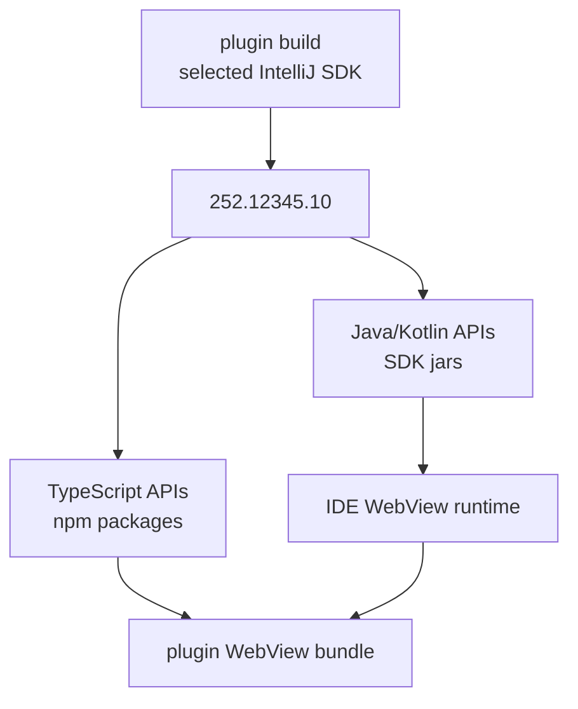
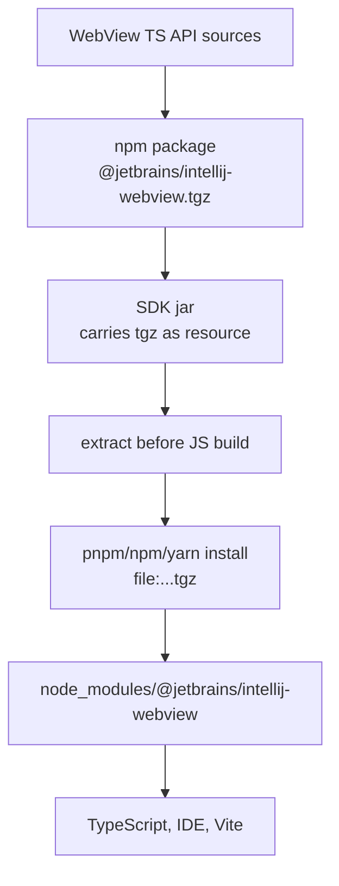

# WebView Frontend SDK Distribution

Status: ⬜ **DESIGN ONLY**. No `@jetbrains/intellij-webview@<sdk>` packages published; no SDK-carried tarballs; no runtime compatibility check. This doc is the v1 spec when work starts.

## Problem

IntelliJ Platform SDK is distributed as Java artifacts, typically a set of jar files. WebView plugin UIs may be written in TypeScript, but TypeScript tooling expects npm-style packages with `package.json`, JavaScript output, and `.d.ts` declarations.

The plugin author should not have to manually guess which TypeScript package version matches the Java SDK. The TypeScript WebView API version must match the selected IntelliJ Platform SDK version.

## Version Contract

For every IntelliJ Platform SDK build that exposes a WebView frontend API, publish matching TypeScript packages.

```text
IntelliJ Platform SDK 252.12345.10
  -> Java/Kotlin SDK jars
  -> @jetbrains/intellij-webview@252.12345.10
  -> @jetbrains/intellij-webview-controls@252.12345.10
```

External plugin projects should pin exact versions.

```json
{
  "devDependencies": {
    "@jetbrains/intellij-webview": "252.12345.10",
    "@jetbrains/intellij-webview-controls": "252.12345.10"
  }
}
```

Avoid floating semver ranges for SDK-coupled packages.

```json
{
  "devDependencies": {
    "@jetbrains/intellij-webview": "^252.12345.10"
  }
}
```

The floating form can install a newer TypeScript wrapper than the runtime bridge available in the target IDE.

## Plugin Author Flow

The plugin author chooses an IntelliJ SDK version once.

```kotlin
intellijPlatform {
  intellijIdeaCommunity("252.12345.10")
}
```

Build tooling should derive frontend package versions from that SDK version.



The ideal developer experience is that the plugin build generates or verifies the frontend dependency pin. The plugin author should not manually synchronize unrelated files.

## Distribution Channels

Use normal npm packages as the TypeScript API format. There can be more than one delivery channel.

### Registry Channel

Publish matching packages to a JetBrains npm registry.

```text
@jetbrains/intellij-webview@252.12345.10
@jetbrains/intellij-webview-controls@252.12345.10
```

Plugin project configuration stays standard.

```json
{
  "devDependencies": {
    "@jetbrains/intellij-webview": "252.12345.10"
  }
}
```

### SDK-Carried Tarball Channel

The IntelliJ SDK can also carry npm package tarballs as resources inside SDK jars.

```text
platform-ui-webview.jar
  /webview/wvi-bridge.js
  /webview-sdk/npm/intellij-webview-252.12345.10.tgz
  /webview-sdk/npm/intellij-webview-controls-252.12345.10.tgz
```

Before JavaScript build, the plugin build extracts the tarballs into a generated directory.

```text
extract from selected SDK jar
  -> build/intellij-webview-sdk/npm/*.tgz
```

Then the package manager consumes them through a normal `file:` dependency.

```json
{
  "devDependencies": {
    "@jetbrains/intellij-webview": "file:build/intellij-webview-sdk/npm/intellij-webview-252.12345.10.tgz"
  }
}
```

This keeps Java distribution compatible with jars while giving frontend tools a standard npm package.



## Runtime Compatibility Check

Exact build dependencies are still not enough. A plugin can be built against one SDK and run in another IDE version. The WebView bridge should expose runtime version or capabilities, and the TypeScript wrapper should validate compatibility at startup.

```ts
import { assertCompatibleRuntime } from "@jetbrains/intellij-webview"

assertCompatibleRuntime()
```

Example failure:

```text
WebView frontend API 252.12345.10 requires IDE WebView runtime >= 252.12345.10, but current runtime is 252.10000.1.
```

Version checks should be paired with capability checks when possible. Capabilities are more robust than raw version comparisons for optional features.

```ts
await webView.requireCapabilities([
  "jsonRpc.hostApi",
  "theme.current",
])
```

## What Goes Into the Package

The base runtime package should be thin. It should type and wrap the bridge provided by the IDE runtime, not bundle a second copy of the bridge.

```text
@jetbrains/intellij-webview
  package.json
  dist/index.js
  dist/index.d.ts
```

The browser still loads the platform bridge from the common WebView path.

```html
<script src="/__webview/wvi-bridge.js"></script>
```

The TypeScript package wraps `window.__WVI__`.

```ts
export const webView = window.__WVI__
```

## Policy

- TypeScript WebView packages are versioned by IntelliJ Platform SDK build/version.
- External plugin projects pin exact TypeScript package versions.
- Build tooling should derive or validate the TypeScript package version from the selected IntelliJ SDK version.
- SDK jars may carry `.tgz` packages, but frontend tools consume extracted or registry-provided npm packages.
- Direct imports from jar paths are not supported for plugin authors.
- The runtime bridge exposes version and/or capabilities.
- The TypeScript wrapper validates runtime compatibility early and fails with a clear message.

## Related Documents

- [Frontend Dependency Resolution](WebView-Frontend-Dependency-Resolution.md)
- [Frontend Framework Policy](WebView-Frontend-Framework-Policy.md)
- [Frontend Testability Without IDE](WebView-Frontend-Testability.md)
- [Frontend Build Strategy](WebView-Frontend-Build-Strategy.md)
