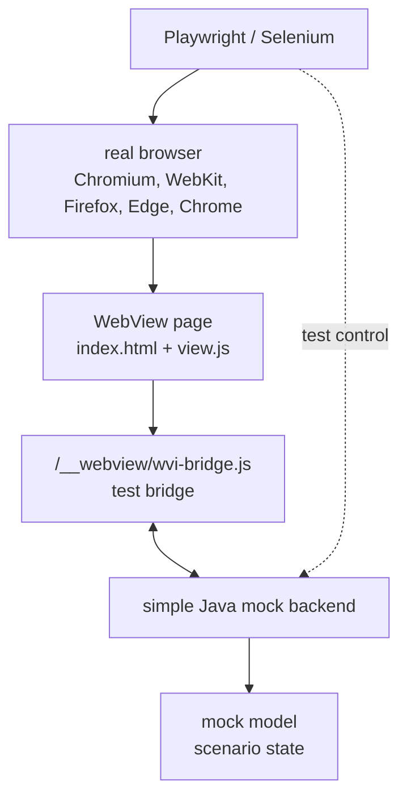
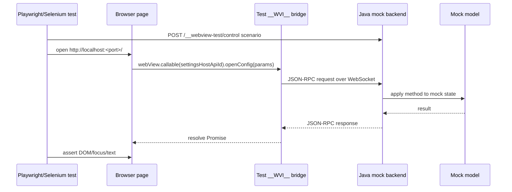
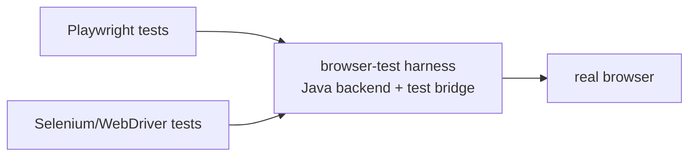
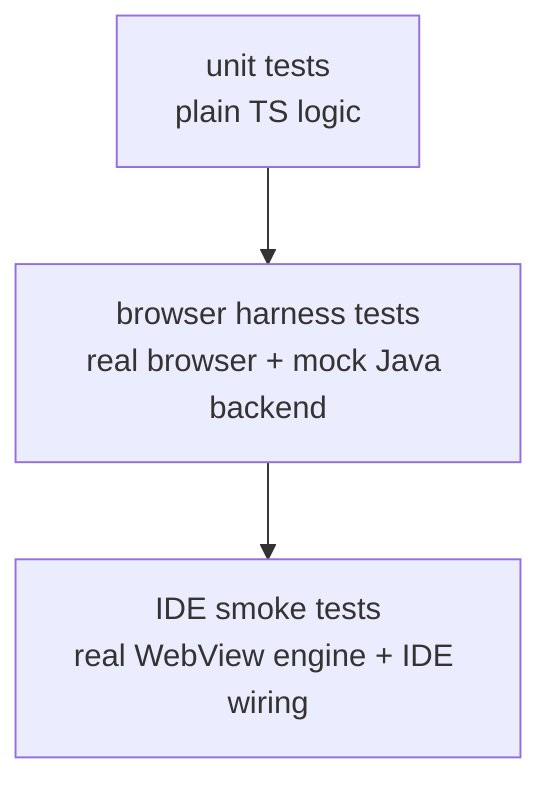
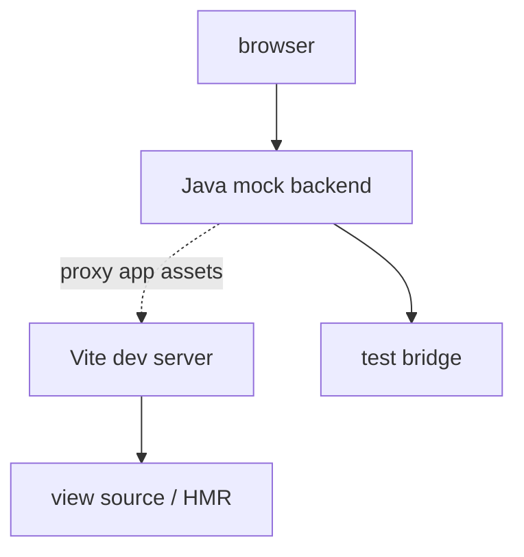

# WebView Frontend Testability Without IDE

Status: ⬜ **DESIGN ONLY**. No `intellij.platform.webview.testkit` Java module, no `@jetbrains/intellij-webview-testkit` npm package, no browser-test bridge in tests, no Java mock backend. This doc is the v1 spec when work starts.

## Goal

Most WebView UI behavior should be testable without starting the IDE. A view should be opened in a real browser, connected to a simple Java mock backend, and tested with Playwright, Selenium/WebDriver, or another browser automation runner.

This does not replace IDE smoke tests. It creates a faster test layer for frontend behavior, layout, keyboard interaction, bridge API usage, and state transitions.

## Basic Idea

In production, the WebView page talks to the IDE through `window.__WVI__`, loaded from the platform runtime asset:

```html
<script src="/__webview/wvi-bridge.js"></script>
```

In browser tests, the page should load a test bridge from the same URL. The test bridge exposes the same public JavaScript API, but forwards JSON-RPC frames to a local Java mock backend instead of to JCEF, WebView2, or WKWebView.



The source view code keeps using the normal runtime wrapper:

```ts
import { apiId, webView, type WebViewCallable } from "@jetbrains/intellij-webview"

interface SettingsHostApi extends WebViewCallable {
  openConfig(params: { path: string }): Promise<void>
}

const settingsHostApiId = apiId<SettingsHostApi>()("settings.host")

const host = webView.callable(settingsHostApiId)
await host.openConfig({ path: "inspectionProfile" })
```

The view should not know whether it runs inside IDE WebView or inside the browser test harness.

## Test Backend Shape

The backend should be a small Java process, not an IDE instance. It can be implemented with the JDK `HttpServer` or another lightweight HTTP/WebSocket stack.

It should provide:

```text
GET  /                         serves the view index.html or redirects to it
GET  /assets/...               serves built static frontend assets, or proxies to Vite dev server
GET  /__webview/wvi-bridge.js  serves the browser-test bridge
WS   /__webview-test/rpc       carries JSON-RPC frames between browser and Java mock backend
POST /__webview-test/control   optional test-only endpoint for scenario setup and state mutation
GET  /__webview-test/state     optional test-only endpoint for assertions/debugging
```

The WebSocket endpoint is preferred for parity with a bidirectional host bridge. It lets the backend push notifications into the page, and it lets the page send host API calls or notifications back to the backend.



## Test Bridge Contract

The browser-test bridge should match the public `window.__WVI__` API used by the frontend wrapper:

```ts
window.__WVI__.transport()              // returns "browser-test"
window.__WVI__.notification(descriptor)
window.__WVI__.notifications(descriptors)
```

The implementation can be separate from the production native bridge. The important constraint is public behavior parity: requests, responses, notifications, cancellation, errors, and missing-method behavior should match production semantics closely enough that view code does not branch on test mode.

If the production bridge adds version or capability checks, the test bridge should expose compatible test values.

```ts
window.__WVI__.transport() // "browser-test"
```

## Mock Model

The Java backend owns a deterministic mock model for the view.

Examples:

```text
Settings view model:
  current profile
  available inspections
  modified flags
  saved/opened paths

Chat view model:
  agents
  modes
  models
  message stream
  busy state
```

Tests should be able to load a scenario before opening the page.

```json
{
  "theme": "dark",
  "profiles": ["Project Default", "Strict"],
  "currentProfile": "Project Default"
}
```

The backend should record calls from the view so tests can assert both UI state and host API usage.

```json
{
  "calls": [
    {
      "method": "settings.host.openConfig",
      "params": { "path": "inspectionProfile" }
    }
  ]
}
```

## Playwright and Selenium

The harness should not be tied to one browser automation library.

Playwright is the recommended default for frontend tests because it can run Chromium, WebKit, and Firefox, has strong tracing and screenshot support, and can mock/inspect network traffic.

Selenium/WebDriver should remain possible, especially for Java-heavy plugin teams or existing test infrastructure. Selenium drives browsers through the WebDriver protocol and has language bindings including Java, Kotlin through Java, JavaScript, Python, Ruby, and C#.



The test backend starts first and prints a URL. The runner then opens that URL and interacts with the page like a user.

```text
start backend -> http://127.0.0.1:57123/
open browser -> navigate to URL
interact -> click/type/keyboard
assert -> DOM text, focus, calls, screenshots
```

## What This Test Layer Covers

This layer can test:

- TypeScript bundle behavior in a real browser;
- Custom Elements or Lit rendering;
- CSS layout and theme application;
- keyboard navigation and focus management;
- user interaction flows;
- calls from the view to the host API;
- host notifications pushed into the view;
- deterministic model states and streamed updates;
- screenshot or visual regression baselines.

It should not claim to test:

- JCEF/WebView2/WKWebView embedding correctness;
- Swing focus transfer;
- native drag and drop;
- actual `WebViewAssetResolver` behavior;
- OS-specific WebView bugs;
- IDE service wiring.

Those still require smaller IDE smoke tests.



## Vite Development Mode

During local development, the Java backend can either serve built static assets or proxy to the Vite dev server.



This preserves one origin for the page and the bridge while still allowing frontend hot reload. Production-like CI tests should usually run against built static assets.

## Testkit Distribution

For plugin authors, this should be delivered as a testkit rather than copied per plugin.

Potential packages:

```text
Java testkit:
  intellij.platform.webview.testkit
    starts mock backend
    serves test bridge
    hosts mock model
    exposes scenario/control APIs

NPM testkit:
  @jetbrains/intellij-webview-testkit
    optional Playwright helpers
    shared test bridge assets
    TypeScript scenario types
```

The testkit version should follow the same SDK-version policy as the runtime API packages.

```text
IntelliJ Platform SDK 252.12345.10
  -> @jetbrains/intellij-webview@252.12345.10
  -> @jetbrains/intellij-webview-testkit@252.12345.10
  -> intellij.platform.webview.testkit Java artifact 252.12345.10
```

## Policy

- WebView UI code should be runnable in a normal browser without IDE when given a test bridge.
- The test bridge must expose the same public `window.__WVI__` API shape as production.
- A simple Java backend should own deterministic mock model state and JSON-RPC method handlers.
- Playwright is the default recommendation for browser UI automation; Selenium/WebDriver remains supported as a runner choice.
- Browser harness tests are required for substantial frontend behavior; IDE smoke tests remain necessary for native WebView integration.
- The testkit should be versioned with the IntelliJ Platform SDK and distributed alongside the TypeScript runtime packages.

## References

- Playwright browsers: https://playwright.dev/docs/browsers
- Playwright network and API mocking: https://playwright.dev/docs/mock
- Selenium WebDriver: https://www.selenium.dev/documentation/webdriver/
- Selenium getting started: https://www.selenium.dev/documentation/webdriver/getting_started/
- Java `HttpServer`: https://docs.oracle.com/en/java/javase/26/docs/api/jdk.httpserver/com/sun/net/httpserver/HttpServer.html
