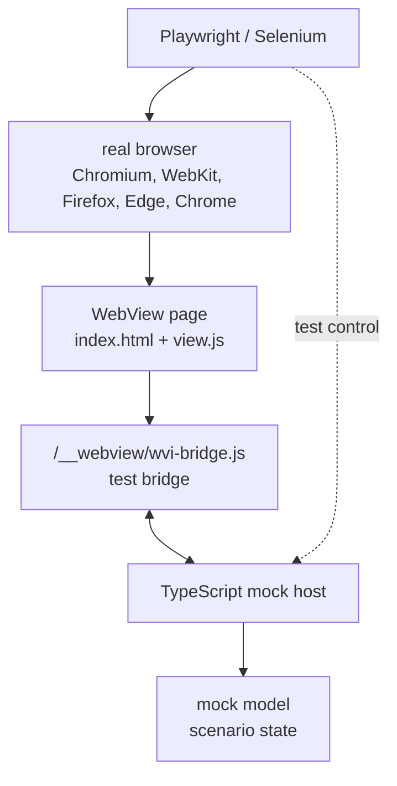
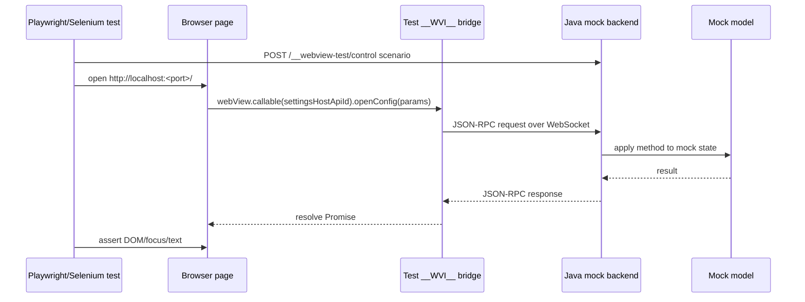
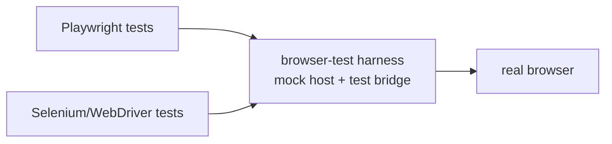
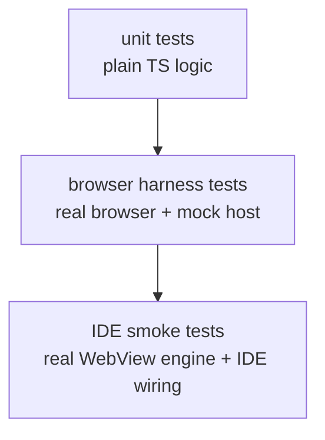
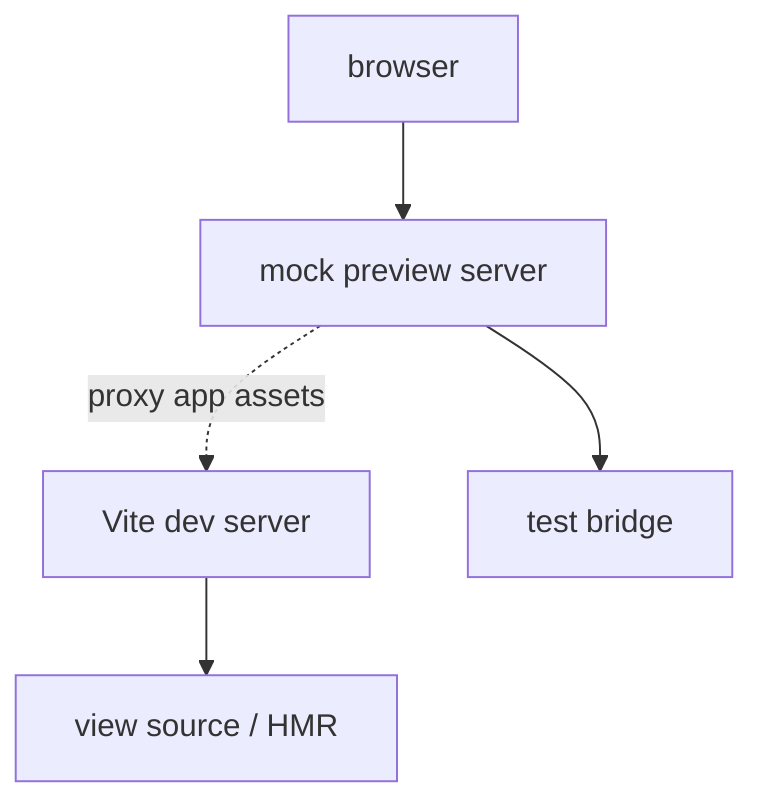

# WebView Frontend Testability Without IDE

Status: ⏳ **BROWSER MOCK TESTKIT V1 IMPLEMENTED FOR TS/VITE**. `@jetbrains/intellij-webview-testkit` exists under `webview-src/packages/testkit`, mock previews can run without Kotlin/IDE, and the demo has an `acp-chat` mock. A Java backend testkit remains a possible later layer for Java-heavy plugin teams.

## Goal

Most WebView UI behavior should be testable without starting the IDE. A view should be opened in a real browser, connected to a deterministic mock host, and tested with Playwright, Selenium/WebDriver, an agent-driven browser session, or another browser automation runner.

This does not replace IDE smoke tests. It creates a faster test layer for frontend behavior, layout, keyboard interaction, bridge API usage, and state transitions.

## Basic Idea

In production, the WebView page talks to the IDE through `window.__WVI__`, loaded from the platform runtime asset:

```html
<script src="/__webview/wvi-bridge.js"></script>
```

In browser tests, the page should load a test bridge from the same URL. The V1 bridge exposes the same public JavaScript API, but routes calls to TypeScript mock implementations instead of to JCEF, WebView2, WKWebView, or Kotlin host code.



The source view code keeps using the normal runtime wrapper:

```text
import { apiId, webView, type WebViewCallable } from "@jetbrains/intellij-webview"

interface SettingsHostApi extends WebViewCallable {
  openConfig(params: { path: string }): Promise<void>
}

const settingsHostApiId = apiId<SettingsHostApi>()("settings.host")

const host = webView.callable(settingsHostApiId)
await host.openConfig({ path: "inspectionProfile" })
```

The view should not know whether it runs inside IDE WebView or inside the browser test harness.

## Browser Mock Testkit V1

The current V1 testkit is a TypeScript/Vite package:

```text
webview-src/packages/testkit
  @jetbrains/intellij-webview-testkit
```

It is intended for fast local previews and browser smoke tests. It does not start Kotlin, Swing, the IDE, or a native WebView engine. It serves the view through Vite, replaces `/__webview/wvi-bridge.js` with a browser mock bridge, and injects a mock entry module.

Public APIs:

```ts
import {
  defineWebViewMock,
  installMockWebViewBridge,
  startWebViewMockPreview,
  type MockWebViewContext,
} from "@jetbrains/intellij-webview-testkit"
import { withWebViewMockBridge } from "@jetbrains/intellij-webview-testkit/vite"
```

Core concepts:

- `defineWebViewMock(setup)` declares a mock scenario.
- `installMockWebViewBridge(options?)` installs the mock `window.__WVI__` bridge.
- `startWebViewMockPreview({ webviewSrcDir, viewId, mock, port? })` starts a preview server for one view and mock.
- `MockWebViewContext.host.implement(apiId, implementation)` implements host APIs that production Kotlin would implement.
- `MockWebViewContext.page.callable(apiId)` calls page APIs registered by the view through `webView.implement(...)`.
- `MockWebViewContext.page.whenImplemented(apiId, callback)` waits until the view registers a page API.
- `MockWebViewContext.calls` records bridge calls for smoke assertions.
- `MockWebViewContext.theme.set(theme, fonts?)` pushes mock theme changes; default mock fonts mirror the common WebView theme variables.
- `withWebViewMockBridge(config, { mock })` wires the bridge replacement into a Vite config.

The test bridge mirrors the public `WebViewBridge` surface used by view code: `callable`, `implement`, `notification`, `notifications`, and `transport`. Page code must keep importing production APIs from `@jetbrains/intellij-webview`; it should not import the testkit or branch on mock mode.

## Mock Location

Mocks live next to tests, not next to production view source:

```text
webview-src/
  views/
    <view-id>/
      index.html
      src/...
  test/
    <view-id>/
      mocks/
        default.ts
      <view-id>.browser.test.ts
```

This keeps production bundles independent from preview-only mock data. `resources/webview/` is generated output and must not contain test mocks.

Mock files usually look like this:

```text
import { apiId, type WebViewCallable, type WebViewImplementable } from "@jetbrains/intellij-webview"
import { defineWebViewMock } from "@jetbrains/intellij-webview-testkit"

interface DemoHostApi extends WebViewCallable {
  listItems(): Promise<{ items: string[] }>
}

interface DemoPageApi extends WebViewImplementable {
  itemAdded(params: { item: string }): void
}

const demoHostApiId = apiId<DemoHostApi>()("demo")
const demoPageApiId = apiId<DemoPageApi>()("demo")

export default defineWebViewMock(context => {
  context.host.implement(demoHostApiId, {
    async listItems() {
      return { items: ["Mock item"] }
    },
  })

  context.page.whenImplemented(demoPageApiId, page => {
    void page.itemAdded({ item: "Mock item" })
  })
})
```

## Preview Entry Points

For IDE Run UI, create a runnable TypeScript entry point next to the mock:

```ts
import { runWebViewMockPreview } from "@jetbrains/intellij-webview-testkit/node"

await runWebViewMockPreview({
  importMetaUrl: import.meta.url,
  viewId: "acp-chat",
  mock: "default",
  open: true,
})
```

For the demo ACP chat view:

```shell
cd community/plugins/ui.webview/demo/webview-src
bun test/acp-chat/preview.ts
```

The entry point resolves `test/acp-chat/mocks/default.ts`, starts Vite, serves `/__webview/wvi-bridge.js` from the testkit, prints a local browser URL, and opens it when `open: true` is set. Use this URL for manual preview, browser automation, or agent-assisted UI iteration. Add a package script such as `"preview:acp-chat": "bun test/acp-chat/preview.ts"` so IDE Run UI can launch the preview through Bun.

Direct Run on a `.ts` preview file uses the IDE's JavaScript runtime setting. Set `Settings | Languages & Frameworks | JavaScript Runtime | Preferred runtime` to `Bun` if you want direct gutter/run actions to create Bun run configurations. If a Node.js configuration was already generated for the preview file, delete or recreate it after switching the runtime. The package script remains the preferred path when the project runtime is not under your control.

`runWebViewMockPreview(...)` is intentionally independent from `process.cwd()`: it derives `webviewSrcDir` from `importMetaUrl` and the testkit adds both the mock directory and the Vite view root to `server.fs.allow`. If Vite says `views/<view-id>/index.html` is outside the serving allow list, fix the testkit Vite allow roots instead of changing production view code, mocks, or the current working directory.

For parameterized CLI runs, use:

```shell
cd community/plugins/ui.webview/demo/webview-src
bun webview-preview acp-chat --mock default
```

For another view, add a mock under `test/<view-id>/mocks/<name>.ts` and run either a dedicated `test/<view-id>/preview.ts` file or:

```shell
bun webview-preview VIEW_ID --mock MOCK_NAME
```

## Browser Smoke Test Pattern

Browser tests should start the preview server, open `preview.url`, drive the UI, and assert both DOM state and bridge calls where useful.

```ts
import { dirname, resolve } from "node:path"
import { fileURLToPath } from "node:url"
import { startWebViewMockPreview } from "@jetbrains/intellij-webview-testkit"

const testDir = dirname(fileURLToPath(import.meta.url))
const webviewSrcDir = resolve(testDir, "../..")

const preview = await startWebViewMockPreview({
  webviewSrcDir,
  viewId: "acp-chat",
  mock: resolve(testDir, "mocks/default.ts"),
})
```

The ACP chat smoke test is the reference example:

```text
demo/webview-src/test/acp-chat/acp-chat.browser.test.ts
demo/webview-src/test/acp-chat/mocks/default.ts
```

It covers the basic chat flow: mock `listAgents()`, successful `startAgent()`, `sendStdin()` call logging plus mock stdout, and `stopAgent()` session shutdown. The mock can call the page API methods registered by the view, such as `onAgentStdout(...)` and `onAgentExit(...)`.

## Package Resolution Notes

`@jetbrains/intellij-webview-testkit` is a private workspace package. In local demo packages, prefer `file:` dependencies or `tsconfig` path mappings instead of registry resolution. The package declares `@jetbrains/intellij-webview` as an optional peer so `bun install` in `webview-src` does not try to download the private runtime package from npm.

If `bun install` fails with a registry 404 for `@jetbrains/intellij-webview`, check that no new nested package declares the private runtime only as a required peer that Bun tries to auto-install.

## Future Java Backend Shape

The original Java-backend harness remains a possible later layer. Use it only when a test needs Java-side state, JVM assertions, or integration with Java/Kotlin test infrastructure. The V1 browser mock testkit should stay the default for frontend layout, interaction, and bridge-contract iteration.

## Test Backend Shape

For a future Java-backed harness, the backend should be a small Java process, not an IDE instance. It can be implemented with the JDK `HttpServer` or another lightweight HTTP/WebSocket stack.

It should provide:

```text
GET  /                         serves the view index.html or redirects to it
GET  /assets/...               serves built static frontend assets, or proxies to Vite dev server
GET  /__webview/wvi-bridge.js  serves the browser-test bridge
WS   /__webview-test/rpc       carries JSON-RPC frames between browser and Java mock backend
POST /__webview-test/control   optional test-only endpoint for scenario setup and state mutation
GET  /__webview-test/state     optional test-only endpoint for assertions/debugging
```

The WebSocket endpoint is preferred for parity with a bidirectional host bridge. It lets the backend push notifications into the page, and it lets the page send host API calls or notifications back to the backend.



## Test Bridge Contract

The browser-test bridge should match the public `window.__WVI__` API used by the frontend wrapper:

```ts
window.__WVI__.transport()              // returns "browser-test"
window.__WVI__.notification(descriptor)
window.__WVI__.notifications(descriptors)
```

The implementation can be separate from the production native bridge. The important constraint is public behavior parity: requests, responses, notifications, cancellation, errors, and missing-method behavior should match production semantics closely enough that view code does not branch on test mode.

If the production bridge adds version or capability checks, the test bridge should expose compatible test values.

```ts
window.__WVI__.transport() // "browser-test"
```

## Mock Model

The Java backend owns a deterministic mock model for the view.

Examples:

```text
Settings view model:
  current profile
  available inspections
  modified flags
  saved/opened paths

Chat view model:
  agents
  modes
  models
  message stream
  busy state
```

Tests should be able to load a scenario before opening the page.

```json
{
  "theme": "dark",
  "profiles": ["Project Default", "Strict"],
  "currentProfile": "Project Default"
}
```

The backend should record calls from the view so tests can assert both UI state and host API usage.

```json
{
  "calls": [
    {
      "method": "settings.host.openConfig",
      "params": { "path": "inspectionProfile" }
    }
  ]
}
```

## Playwright and Selenium

The harness should not be tied to one browser automation library.

Playwright is the recommended default for frontend tests because it can run Chromium, WebKit, and Firefox, has strong tracing and screenshot support, and can mock/inspect network traffic.

Selenium/WebDriver should remain possible, especially for Java-heavy plugin teams or existing test infrastructure. Selenium drives browsers through the WebDriver protocol and has language bindings including Java, Kotlin through Java, JavaScript, Python, Ruby, and C#.



The preview/test backend starts first and prints a URL. The runner then opens that URL and interacts with the page like a user.

```text
start backend -> http://127.0.0.1:57123/
open browser -> navigate to URL
interact -> click/type/keyboard
assert -> DOM text, focus, calls, screenshots
```

## What This Test Layer Covers

This layer can test:

- TypeScript bundle behavior in a real browser;
- Custom Elements or Lit rendering;
- CSS layout and theme application;
- keyboard navigation and focus management;
- user interaction flows;
- calls from the view to the host API;
- host notifications pushed into the view;
- deterministic model states and streamed updates;
- screenshot or visual regression baselines.

It should not claim to test:

- JCEF/WebView2/WKWebView embedding correctness;
- Swing focus transfer;
- native drag and drop;
- actual `WebViewAssetResolver` behavior;
- OS-specific WebView bugs;
- IDE service wiring.

Those still require smaller IDE smoke tests.



## Vite Development Mode

During local development, the mock preview server can either serve built static assets or proxy to the Vite dev server.



This preserves one origin for the page and the bridge while still allowing frontend hot reload. Production-like CI tests should usually run against built static assets.

## Testkit Distribution

For plugin authors, this should be delivered as a testkit rather than copied per plugin.

Potential packages:

```text
Java testkit:
  intellij.platform.webview.testkit
    starts mock backend
    serves test bridge
    hosts mock model
    exposes scenario/control APIs

NPM testkit:
  @jetbrains/intellij-webview-testkit
    optional Playwright helpers
    shared test bridge assets
    TypeScript scenario types
```

The testkit version should follow the same SDK-version policy as the runtime API packages.

```text
IntelliJ Platform SDK 252.12345.10
  -> @jetbrains/intellij-webview@252.12345.10
  -> @jetbrains/intellij-webview-testkit@252.12345.10
  -> intellij.platform.webview.testkit Java artifact 252.12345.10
```

## Policy

- WebView UI code should be runnable in a normal browser without IDE when given a test bridge.
- The test bridge must expose the same public `window.__WVI__` API shape as production.
- The mock host should own deterministic mock model state and API handlers. In V1 this host is TypeScript; a Java backend may be added for Java/Kotlin test infrastructure.
- Playwright is the default recommendation for browser UI automation; Selenium/WebDriver remains supported as a runner choice.
- Browser harness tests are required for substantial frontend behavior; IDE smoke tests remain necessary for native WebView integration.
- The testkit should be versioned with the IntelliJ Platform SDK and distributed alongside the TypeScript runtime packages.

## References

- Playwright browsers: https://playwright.dev/docs/browsers
- Playwright network and API mocking: https://playwright.dev/docs/mock
- Selenium WebDriver: https://www.selenium.dev/documentation/webdriver/
- Selenium getting started: https://www.selenium.dev/documentation/webdriver/getting_started/
- Java `HttpServer`: https://docs.oracle.com/en/java/javase/26/docs/api/jdk.httpserver/com/sun/net/httpserver/HttpServer.html
