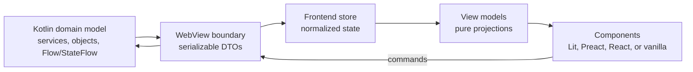

# WebView Frontend View Model Patterns

Status: design guide for WebView UI state, bridge DTOs, and frontend view models.

Audience: platform and plugin authors building WebView pages on top of `WebViewMessageBus` and `window.__WVI__`.

Related docs:

- [WebView JSON-RPC Design](../architecture/WebView-JsonRpc-Design.md) - call, notification, cancellation, and API binding details.
- [Kotlin Reactive Stream Ownership Guideline](../guides/kotlin-reactive-stream-ownership-guideline.md) - Kotlin-side ownership rules for `Flow`, `StateFlow`, and related primitives.
- [Frontend Testability Without IDE](WebView-Frontend-Testability.md) - browser test harness and mock model guidance.

## Purpose

WebView UI cannot reuse the Compose mental model where the view can hold a complex Kotlin object graph with reactive properties. A WebView page is a separate browser runtime. It should see a serializable protocol, not Kotlin services, Swing objects, `Flow`, `StateFlow`, or mutable domain entities.

The recommended model is:



The WebView boundary is intentionally narrow. Kotlin owns core state and lifecycle. JSON-RPC carries snapshots, events, commands, and query responses. The frontend recreates reactivity with browser-side stores, reducers, selectors, and subscriptions.

## Vocabulary

| Term | Meaning | Boundary rule |
| --- | --- | --- |
| Core model | Kotlin-owned domain/service state, often backed by domain objects and streams. | Never expose directly to WebView. |
| Bridge DTO | `@Serializable` request, response, snapshot, or event payload. | Must contain only protocol data: primitives, lists, maps, IDs, and nested serializable DTOs. |
| Frontend store | Browser-side state container for a feature or view. | Owns frontend reactivity and local UI state. |
| View model / projection | Plain UI-ready object derived from DTO/store state. | Should be recomputable and free of host references. |
| Command | JS -> Kotlin intent, usually a JSON-RPC call or notification. | Carries user intent, not a mutated Kotlin object. |
| Snapshot | Kotlin -> JS canonical state for a feature, scope, or page. | Good for bootstrap and low-frequency full refreshes. |
| Event | Kotlin -> JS incremental state change. | Good for live or high-frequency updates. Must be idempotent or versioned when replay/order matters. |
| Optimistic overlay | Frontend-only pending state applied before Kotlin confirmation. | Must reconcile with canonical Kotlin state or roll back. |

## Core Boundary Rules

- Keep Kotlin domain objects, services, `Flow`, `StateFlow`, lifecycle, validation authority, and threading rules on the Kotlin side.
- Expose stable JSON-RPC contracts with `@Serializable data class` DTOs. Prefer IDs over object references.
- Treat every bridge payload as an immutable value. If the UI needs to change it, send a command and wait for a canonical snapshot/event or apply an explicit optimistic overlay.
- Keep frontend view models as plain TypeScript objects derived from store state. They should not hide RPC calls, timers, DOM nodes, or service handles.
- Split state by ownership and change frequency: domain sync state, input drafts, selection, viewport, and feature caches should not be forced into one large store.
- Make reducers and projection functions pure. Framework hooks or components should subscribe, call commands, and render; they should not own cross-feature synchronization policy.
- Prefer narrow selectors. A component that renders one row should subscribe to that row or row view model, not to the whole feature map.

## Frontend Sync Patterns

For WebView-style frontends, the useful pattern is a TypeScript UI talking to a host/runtime boundary instead of sharing live objects with the backend. Such UIs do not need formal `ViewModel` classes. Their view models can be plain immutable projections built from DTOs, normalized stores, and selectors.

Patterns worth using:

- Normalized sync state: feature entities are stored by stable ID and scoped by an explicit project, module, root, tab, or feature scope. Ordered lists carry IDs; maps carry entities.
- Scoped child stores: each project, root, tab, or view instance can have an independent store. Inactive scopes can be pinned, evicted, or lazily bootstrapped.
- Bootstrap then stream: the frontend first loads critical snapshots, then applies host events through a reducer. Deferrable data is loaded later.
- Reducer discipline: event handlers update only affected state branches, skip no-op updates, and preserve references where possible.
- Store splitting: synchronized domain data is separate from input drafts, selection, viewport/scroll memory, and feature caches.
- Pure projections: complex timelines, trees, boards, or forms are rendered from derived records and summary view models, not from mutable domain objects.
- Optimistic overlay: pending edits are inserted locally with client IDs, then reconciled with host confirmation or rolled back on failure.
- Runtime abstraction: IDE WebView, browser test harness, and alternate host implementations provide the same frontend API shape; feature code does not branch on the host environment.

Patterns to apply carefully:

- A large legacy UI store can grow around convenience. Use the boundary and split-store ideas, not the store size.
- Broad subscriptions are acceptable only for low-frequency, isolated state. High-frequency rendering needs leaf selectors and stable projections.
- IntelliJ WebView should prefer explicit Kotlin serialization contracts and tests around DTO compatibility.

## Recommended IntelliJ Shape

Use one small protocol surface per feature. Put domain logic behind a Kotlin owner. Convert owner state into DTOs near the WebView boundary.

```kotlin
@Serializable
data class IndexingStatusSnapshot(
  val running: Boolean,
  val scannedFiles: Int,
  val totalFiles: Int,
  val updatedAtMillis: Long,
)
```

Register explicit handlers for JS -> Kotlin commands, and publish Kotlin -> JS snapshots or events through `WebViewMessageBus`.

```kotlin
class IndexingPanelBridge(
  private val scope: CoroutineScope,
  private val bus: WebViewMessageBus,
  private val model: IndexingStatusModel,
) {
  fun start() {
    scope.launch {
      model.status.collect { status ->
        bus.notify(IndexingNotifications.statusChanged, status.toSnapshot())
      }
    }
  }
}
```

On the frontend, keep protocol DTOs separate from view models.

```ts
type IndexingStatusSnapshot = {
  running: boolean
  scannedFiles: number
  totalFiles: number
  updatedAtMillis: number
}

type StatusBadgeViewModel = {
  text: string
  tone: "idle" | "running" | "complete"
  progressPercent: number
}

function toStatusBadge(snapshot: IndexingStatusSnapshot): StatusBadgeViewModel {
  const total = Math.max(snapshot.totalFiles, 0)
  const scanned = Math.max(snapshot.scannedFiles, 0)
  const progressPercent = total === 0 ? 0 : Math.min(100, Math.round(scanned * 100 / total))
  return {
    text: snapshot.running ? `Indexing ${progressPercent}%` : "Indexing idle",
    tone: snapshot.running ? "running" : progressPercent >= 100 ? "complete" : "idle",
    progressPercent,
  }
}
```

The DTO is a wire shape. The view model is a rendering shape. Keep them different unless the UI is truly trivial.

## Pattern Selection Matrix

| Scenario | Kotlin -> JS | JS -> Kotlin | Frontend state | View model shape |
| --- | --- | --- | --- | --- |
| Status badge | Snapshot notification | Optional refresh command | Last snapshot | One badge object |
| Command button | Optional result | Call/notification | Pending/error flag | Button enabled/title |
| Settings form | Snapshot + save result | Apply/reset calls | Saved + draft + validation | Form fields and modified flags |
| Filtered list | Query response or snapshot | Query/refresh commands | Normalized cache | Sorted rows, groups, counts |
| Live progress | Initial snapshot + events | Cancel/pause commands | Normalized operations | Progress rows and summary |
| Optimistic collection | Canonical events | Add/delete/update commands | Canonical state + overlay | Merged visible items |
| Nested timeline | Bootstrap pages + stream events | Submit/cancel/resolve commands | Normalized items/fragments | Timeline records, streaming status |
| Multi-scope UI | Scoped snapshots/events | Scoped commands | Child store per scope | Scope-specific projections |
| Runtime capability | Capability snapshot | Host API calls | Runtime facade state | Feature availability flags |

## Scenario Cookbook

### 1. Read-only Status Badge

Use when a panel needs small, low-frequency state such as indexing, connection, sync, or inspection status.

Backend contract:

```kotlin
@Serializable
data class ConnectionStatusSnapshot(
  val connected: Boolean,
  val displayName: String?,
  val description: String,
)
```

Frontend state:

```ts
type ConnectionState = {
  snapshot: ConnectionStatusSnapshot | null
}
```

View model:

```ts
function toConnectionBadge(snapshot: ConnectionStatusSnapshot | null) {
  if (snapshot == null) return { label: "Connecting", tone: "pending" as const }
  if (snapshot.connected) return { label: snapshot.displayName ?? "Connected", tone: "ok" as const }
  return { label: snapshot.description, tone: "warning" as const }
}
```

Rules:

- Snapshot-only is enough when the full state is small.
- Do not expose a Kotlin `Connection` object or `StateFlow<ConnectionStatus>` to JS.
- Keep display text/tone derivation in the frontend unless localization or product wording requires Kotlin-owned strings.

### 2. Command-only Button

Use when the UI triggers host behavior but does not own domain state, for example opening settings, revealing a file, or invoking an IDE action.

Frontend command:

```ts
type HostApi = {
  openSettings(params: { configurableId: string }): Promise<void>
}

const host = window.__WVI__.proxyApi("example.host") as HostApi

async function openInspections() {
  await host.openSettings({ configurableId: "preferences.inspections" })
}
```

Rules:

- A command button usually needs only local `pending` and `error` flags.
- If the command changes visible state, Kotlin should publish a refreshed snapshot or return the new canonical state.
- Avoid putting IDE action objects or service handles into frontend state.

### 3. Editable Settings Form

Use when the page edits persisted or Kotlin-owned settings.

Backend contract:

```kotlin
@Serializable
data class SettingsSnapshot(
  val codeVisionEnabled: Boolean,
  val defaultProfileId: String,
  val profiles: List<ProfileDto>,
  val version: Long,
)

@Serializable
data class ApplySettingsRequest(
  val codeVisionEnabled: Boolean,
  val defaultProfileId: String,
  val baseVersion: Long,
)
```

Frontend state:

```ts
type SettingsState = {
  saved: SettingsSnapshot | null
  draft: ApplySettingsRequest | null
  saving: boolean
  error: string | null
}

function isModified(state: SettingsState): boolean {
  if (state.saved == null || state.draft == null) return false
  return state.saved.codeVisionEnabled !== state.draft.codeVisionEnabled ||
    state.saved.defaultProfileId !== state.draft.defaultProfileId
}
```

Rules:

- Keep `saved` and `draft` separate.
- Kotlin validates and returns canonical state after save.
- Include a version, modification stamp, or ETag when concurrent host-side changes can happen.
- The frontend may show local validation early, but Kotlin remains the authority for persisted settings.

### 4. Filtered List / Feature Cache

Use when the view shows many items with filters, sorting, and refresh behavior: search results, problems, branches, tests, or inspections.

Frontend store:

```ts
type EntityCache<T> = {
  byId: Record<string, T>
  ids: string[]
  loading: boolean
  error: string | null
  fetchedAtMillis: number | null
}
```

Projection:

```ts
function projectRows(cache: EntityCache<ProblemDto>, filter: ProblemFilter): ProblemRowViewModel[] {
  return cache.ids
    .map(id => cache.byId[id])
    .filter(problem => matchesFilter(problem, filter))
    .sort(compareProblems)
    .map(problem => ({
      id: problem.id,
      title: problem.message,
      location: `${problem.fileName}:${problem.line}`,
      severity: problem.severity,
    }))
}
```

Rules:

- Store entities by ID; derive sorted rows.
- Keep filter/search text as UI state unless it is part of the backend query contract.
- Refresh commands should replace the canonical cache or apply a versioned delta.
- Row components should subscribe to row view models or row IDs, not the whole feature state.

### 5. Live Progress Stream

Use when Kotlin owns long-running operations and sends frequent changes.

Backend contract:

```kotlin
@Serializable
data class OperationSnapshot(
  val operations: List<OperationDto>,
  val version: Long,
)

@Serializable
data class OperationProgressEvent(
  val operationId: String,
  val phase: String,
  val completed: Int,
  val total: Int,
  val version: Long,
)
```

Reducer:

```ts
function applyOperationProgress(state: OperationsState, event: OperationProgressEvent): OperationsState {
  const current = state.byId[event.operationId]
  if (current && current.version > event.version) return state
  const next = current == null
    ? {
        operationId: event.operationId,
        phase: event.phase,
        completed: event.completed,
        total: event.total,
        version: event.version,
      }
    : { ...current, ...event }
  return {
    ...state,
    byId: {
      ...state.byId,
      [event.operationId]: next,
    },
  }
}
```

Rules:

- Bootstrap with a snapshot, then apply events.
- Use versions or monotonic timestamps if out-of-order delivery is possible.
- Coalesce high-frequency events before rendering when updates can arrive faster than the UI should repaint.
- Derived progress text, severity, and actions belong in view models.

### 6. Optimistic Collection Mutation

Use when the UI should feel immediate: adding, updating, reordering, or deleting an item.

Frontend state:

```ts
type OptimisticOverlay<T> = {
  pendingByClientId: Record<string, T>
  failedByClientId: Record<string, string>
}
```

Flow:

```text
user action
  -> create clientId
  -> add optimistic item to overlay
  -> send command with clientId
  -> Kotlin validates and mutates core model
  -> Kotlin publishes canonical event with real id and clientId
  -> frontend removes optimistic item and renders canonical item
```

Rules:

- Include a client-generated ID in commands that need optimistic reconciliation.
- Keep optimistic data separate from canonical `byId` state.
- Roll back or mark failed items when Kotlin rejects the command.
- Do not let optimistic state become the source of truth.

### 7. Nested Timeline / Incremental Feed

Use when a page has nested entities, incremental updates, pagination, and derived grouping. This is the closest WebView equivalent to a complex Compose screen.

Canonical frontend store:

```ts
type TimelineState = {
  containersById: Record<string, ContainerDto>
  itemIdsByContainerId: Record<string, string[]>
  itemsById: Record<string, ItemDto>
  fragmentsByItemId: Record<string, FragmentDto[]>
  statusByContainerId: Record<string, ContainerStatusDto>
}
```

View model projection:

```ts
type TimelineRecord = {
  id: string
  item: ItemDto
  fragments: FragmentDto[]
  streaming: boolean
}

function projectTimelineRecords(state: TimelineState, containerId: string): TimelineRecord[] {
  const itemIds = state.itemIdsByContainerId[containerId] ?? []
  const records: TimelineRecord[] = []
  for (const itemId of itemIds) {
    const item = state.itemsById[itemId]
    if (!item) continue
    records.push({
      id: item.id,
      item,
      fragments: state.fragmentsByItemId[itemId] ?? [],
      streaming: false,
    })
  }
  return markStreamingRecord(records, state.statusByContainerId[containerId])
}
```

Rules:

- Normalize canonical entities first; group them only in projections.
- Keep streaming state derived from item, fragment, and status state.
- Keep viewport, scroll anchors, and selected item state separate from domain sync state.
- Use stable IDs and memoized projections to avoid re-rendering the whole timeline on each fragment update.
- Page older history explicitly. Do not require one full object graph for the entire scope.

### 8. Multi-project or Multi-scope UI

Use when the same WebView feature can show state for several projects, modules, roots, contexts, or tool window tabs.

State shape:

```ts
type ScopedStores<T> = {
  activeScopeId: string | null
  byScopeId: Record<string, T>
  pinnedScopeIds: string[]
}
```

Rules:

- Put `scopeId` into every snapshot, event, and command.
- Route incoming events before reducing state.
- Bootstrap active scopes first; lazy-load inactive scopes.
- Evict inactive scopes when memory matters, but keep explicit pinned scopes.
- Never let state from one scope leak into another by relying on global singleton state.

### 9. Runtime Capability Abstraction

Use when the same frontend source can run in several hosts or test harnesses.

Frontend API wrapper:

```ts
type RuntimeApi = {
  transport(): string
  requireCapabilities(capabilities: string[]): Promise<void>
  host: {
    openFile(params: { path: string; line?: number }): Promise<void>
  }
}
```

Rules:

- Feature code depends on a typed runtime wrapper, not on raw environment globals.
- Runtime detection belongs in the wrapper or bootstrap layer.
- Tests should provide a compatible mock runtime and scenario model.
- Missing capabilities should fail early with a clear view-level error, not by branching throughout view model code.

## View Model Design Checklist

Before adding a WebView view model, answer these design checks:

- What Kotlin owner has the canonical state and lifecycle?
- What is the smallest serializable snapshot needed to bootstrap the view?
- Which updates are full snapshots, and which are incremental events?
- Does every entity that can change independently have a stable ID?
- Which state is domain sync state, and which is local UI state?
- Can the view model be recomputed from store state without side effects?
- Are high-frequency events coalesced, throttled, or scoped narrowly enough?
- How does the frontend recover after reconnect, reload, or stale events?
- How are optimistic changes reconciled with canonical Kotlin state?
- Can the same state transition be tested with a browser harness and mock model?

## Anti-patterns

- Passing `Flow`, `StateFlow`, `Channel`, service instances, Swing components, project objects, PSI objects, or domain entities through a WebView contract.
- Mirroring a whole Kotlin object graph as nested mutable JavaScript objects.
- Treating DTOs as view models for complex UI just because field names happen to render today.
- Hiding RPC calls inside view model getters or projection functions.
- Combining canonical backend state, input drafts, selection, scroll state, and cache metadata into one unstructured store.
- Replacing a full normalized cache for every high-frequency event when a single entity update is enough.
- Relying on arrival order without versions, sequence numbers, or idempotent reducers for streams where order matters.
- Making framework-specific component state the platform contract.

## Testing Guidance

For production code that follows these patterns, test in layers:

- Kotlin unit tests for DTO mapping, validation, command handling, and stream-to-event conversion.
- TypeScript unit tests for reducers and projection functions.
- Browser harness tests with a mock Java backend for user flows, bridge calls, streamed updates, and optimistic rollback.
- Small IDE smoke tests for real WebView embedding, asset loading, focus, and native engine behavior.

Do not use Java build success as proof that frontend state modeling is correct. The most important behavior is in the protocol contract, reducers, projections, and user-visible state transitions.
